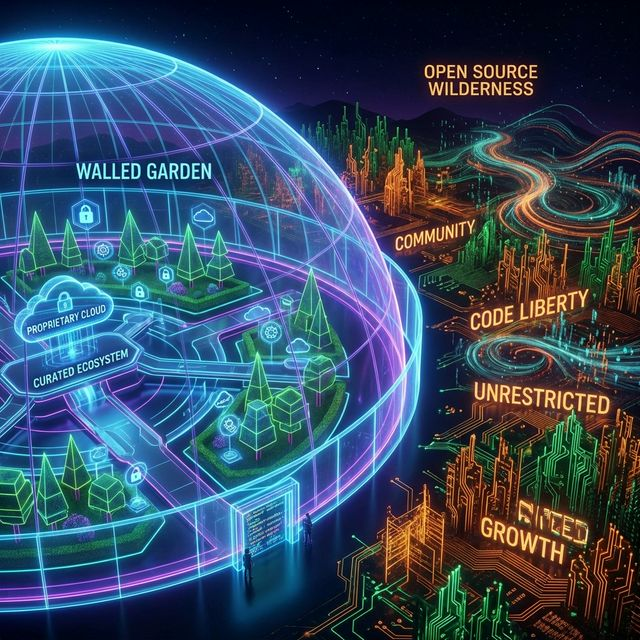
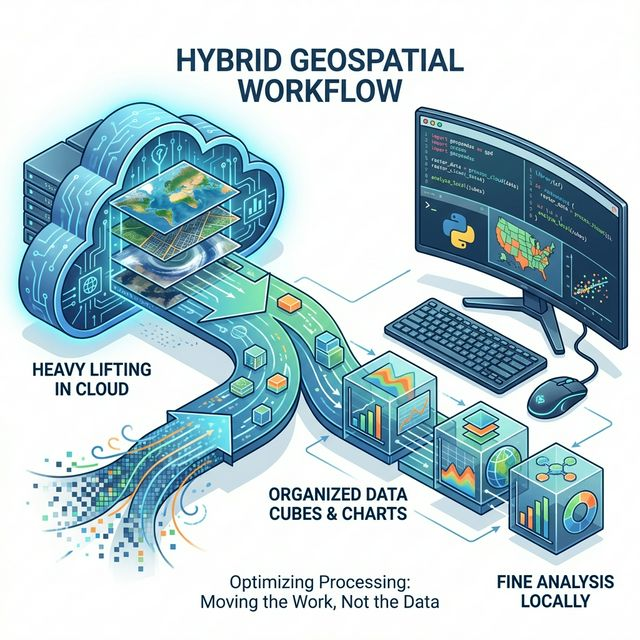
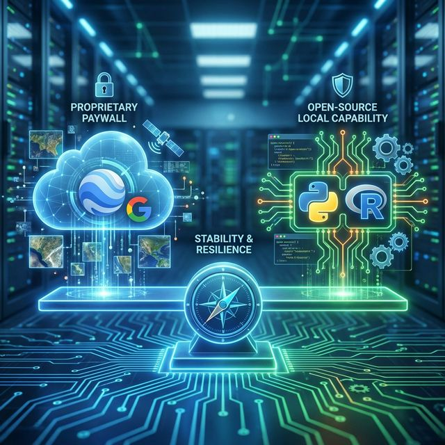

In the modern geospatial landscape, **Google Earth Engine (GEE)** stands as a colossus. Its ability to process petabytes of satellite imagery in seconds has not just revolutionized remote sensing; it has fundamentally altered how we think about planetary-scale analysis. For many students and researchers, "Remote Sensing" has become synonymous with "typing JavaScript into the GEE Code Editor."

However, this convenience comes with a hidden cost. As powerful as GEE is, it remains a **proprietary tool** owned by a tech giant. This introduces a critical vulnerability: the risk of the "Walled Garden."

## ⚠️ The Concern: Google's Proprietary Tool & Paywall Risk

The concern is simple: **Google Earth Engine is a proprietary product.** Unlike open-source software, its future is entirely dictated by corporate strategy, not community consensus.

### The "Paywall Risk"
History is littered with Google products that started free and later became paid or were discontinued (Google Reader, the shift in Google Maps API pricing, Google Photos storage limits). 
While GEE is free for research *now*, there is no guarantee it will remain so forever. A sudden shift to a paywall model could leave researchers and students stranded, with their code locked behind a subscription they cannot afford.

### The "Walled Garden" Problem
When you build your entire workflow in GEE, you are building inside a rented house.
*   **Vendor Lock-in:** Your code (GEE JavaScript) is not easily portable. You cannot simply run a GEE script on your local machine or another cloud provider without a complete rewrite.
*   **Black Box Algorithms:** While we trust Google's implementations, the underlying code for many algorithms is not visible. Science demands transparency, and "trust us" is not a scientific standard.

::: {.callout-warning}
### Key Risks of Sole Reliance on GEE
*   **Sustainability:** If Google changes the Terms of Service, your project could die overnight.
*   **Reproducibility:** If a specific GEE algorithm changes under the hood, your results might change without you knowing why.
*   **Cost:** Commercial use is already paid; academic use is subsidized by Google's goodwill.
:::

## 🚀 We Cannot Ignore Massive Potential

Having said that, we cannot just ignore GEE's massive potential. It solves the **Data Gravity** problem—instead of downloading petabytes of data to your computer, you send your code to the data.

For large-scale, server-based analysis, GEE is unrivaled:
*   **Global Scale:** Computing Normalized Difference Vegetation Index (NDVI) for the entire planet over 20 years takes minutes in GEE, but would take months on a local workstation.
*   **Instant Access:** The multi-petabyte catalog of Landsat, Sentinel, and MODIS data is instantly available without downloading a single file.

Startups and researchers leverage this for rapid prototyping and global monitoring systems that would otherwise be impossible. **To ignore GEE is to ignore a superpower.**

## ⚖️ Balancing is the Smartest Way

So, what is the solution? It is not to abandon GEE, but to **balance** it. We must give more focus to **Open Source Technology**.

The smartest geospatial workflow is a **Hybrid Approach**: 
1.  Use GEE for what it does best (Heavy Lifting).
2.  Use Open Source (Python/R) for what *it* does best (Analysis, Statistics, Visualization, and Freedom).

### The Hybrid Workflow in Practice

| Stage | Tool | Action |
| :--- | :--- | :--- |
| **1. Ingestion & Pre-processing** | **Google Earth Engine** | Filter collections, cloud masking, temporal compositing (e.g., median annual composites). |
| **2. Export** | **GEE to Drive/Cloud** | Export only the *results* (the processed bands or indices) as manageable GeoTIFFs or CSVs. |
| **3. Analysis & Modeling** | **Python / R** | Perform deep statistical analysis, machine learning (Scikit-Learn, PyTorch), or complex geostatistics. |
| **4. Visualization** | **Python (Matplotlib) / R (ggplot2)** | Create publication-quality maps and charts that you fully own and control. |

## 🐍 Importance of Open Source Technology: Python and R

Open source technologies are the bedrock of scientific reproducibility. When you write code in Python or R, you use libraries built by the community, for the community. **You own the stack.**

### Why Focus on Open Source?
1.  **Transparency:** You can inspect the code of every library you use (`pandas`, `sf`). You know exactly what the math is doing.
2.  **Portability:** Python code runs on your laptop, on AWS, on Azure, or on a supercomputer. You are not tied to Google.
3.  **Community:** The geospatial community in Python and R is vibrant and innovative. 
    *   **Python:** The powerhouse of modern data science. Libraries like `geopandas`, `rasterio`, `xarray`, and the **Pangeo** ecosystem allow for scalable analyses that rival GEE but on open infrastructure.
    *   **R:** The gold standard for statistics. Packages like `sf`, `terra`, and `tmap` make spatial analysis intuitive and statistically rigorous.

::: {.callout-tip}
### The Future is Open
By mastering Python and R, you future-proof your career. Tools may come and go (remember ArcView 3?), but the concepts and the open-source languages remain relevant for decades.
:::

## Conclusion

The concern regarding Google Earth Engine's proprietary nature is valid. The risk of paywalls and vendor lock-in is real. However, its computational power is undeniably transformative.

The key is **Balance**. Do not let GEE become a "crutch" that limits your understanding of underlying geospatial concepts. Instead, treat it as one powerful tool in a larger toolbox. Prioritize learning open-source technologies like **Python and R**. They offer the freedom, flexibility, and transparency that true scientific inquiry demands.

**Use the Cloud for scale, but keep your feet on the Open Source ground.**

## References

1.  **Gorelick, N., et al. (2017).** "Google Earth Engine: Planetary-scale geospatial analysis for everyone." *Remote Sensing of Environment*.
2.  **Pangeo Project.** (2025). "A community platform for Big Data geoscience." [pangeo.io](https://pangeo.io)
3.  **Open Source Geospatial Foundation (OSGeo).** "Empowering everyone with open source geospatial." [osgeo.org](https://www.osgeo.org/)
