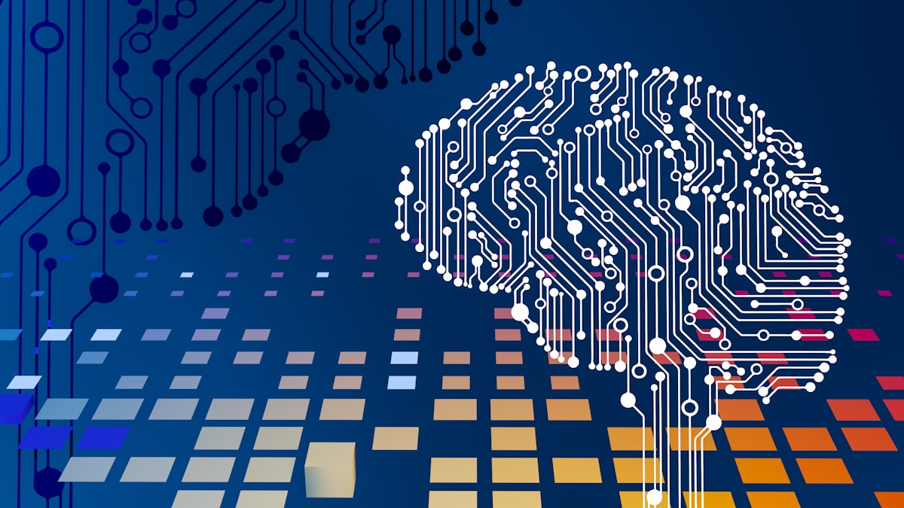
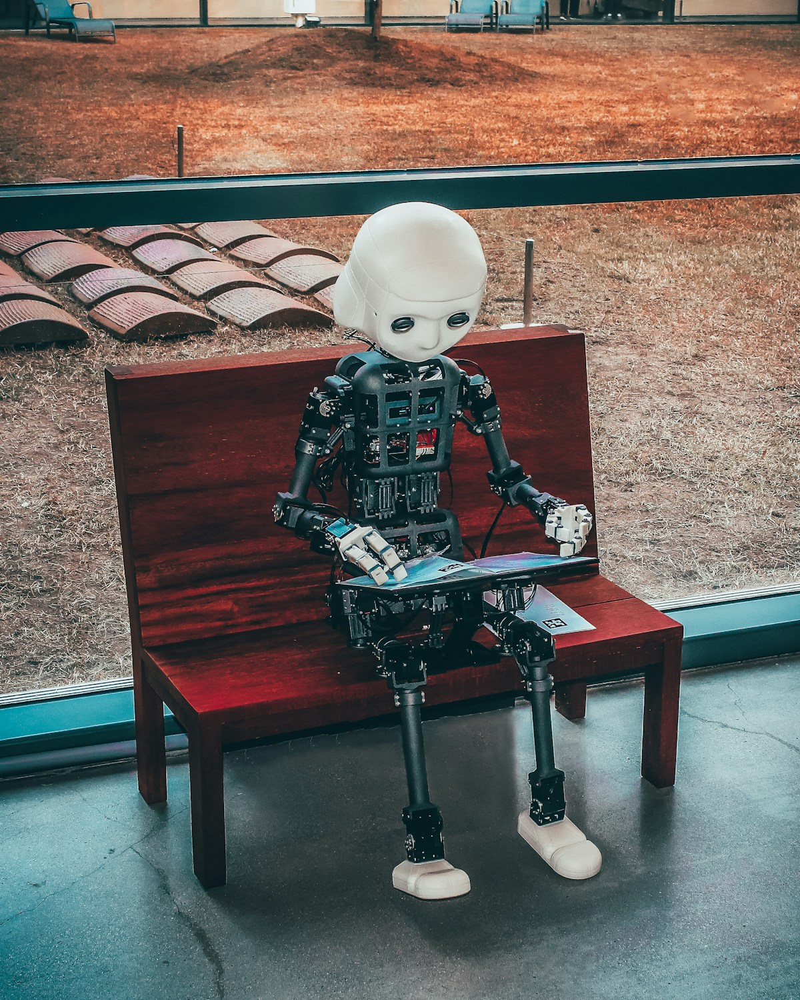
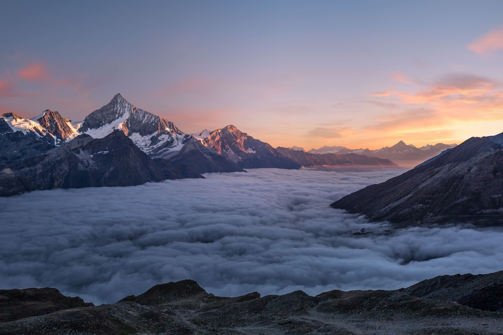

The landscape of geographical research is evolving at an unprecedented pace. As we look toward 2030, the traditional, labor-intensive workflows of coding, spatial analysis, and machine learning are on the verge of a massive paradigm shift. The catalyst for this transformation? **Agentic AI**. 

In the near future, the actual mechanics of computational geographical research will be largely automated, profoundly reshaping what it means to be a geographer and making firsthand, field-based research more valuable than ever.

## The Shift to Agentic AI Workflows

Currently, a significant portion of a geospatial researcher's time is spent wrestling with syntax, building data pipelines, training deep learning models, and debugging code. By 2030, these coding and machine learning workflows will operate primarily in an "agentic mode."

Instead of a human manually typing out Python or R scripts to process satellite imagery or run spatial regressions, Agentic AI systems will take the reins. The AI will autonomously:
- Ingest the research objective or prompt.
- Write the necessary code from scratch.
- Run the analysis and interpret execution errors.
- Debug its own code iteratively.
- Finish the task and present the results.

In this new dynamic, the human researcher's role in computational tasks will be sharply curtailed. Researchers will primarily act as *verifiers* and *directors*, reading the code and outputs produced by the system rather than building it line by line.

## A Real-World Example: Claude as a Geography Research Co-worker

One of the most compelling early demonstrations of this shift is the use of **[Claude](https://claude.ai)** (by Anthropic) as an AI research co-worker. Claude is not merely a chatbot—it is a capable agentic assistant that can take on substantial portions of a researcher's computational and analytical workload right now, in 2026, years before the full 2030 transition.

Consider a practical geography research workflow using Claude:

1. **Literature Review**: A researcher prompts Claude with a research question on, say, *urban heat island effects in South Asian megacities*. Claude scans, summarizes, and synthesizes dozens of relevant papers, producing a structured literature map in minutes.

2. **Code Generation**: The researcher asks Claude to *"write a Python script using Google Earth Engine to extract LST (Land Surface Temperature) time series data for Kolkata from 2010–2024."* Claude writes the complete, functional script—no prior GEE coding knowledge required from the researcher's side.

3. **Debugging Autonomously**: When the script throws an error, the researcher pastes the traceback back to Claude. Claude identifies the issue, corrects the code, and explains the fix—behaving exactly like a senior co-worker reviewing a junior's code.

4. **Statistical Analysis & Interpretation**: Claude then takes the extracted data, runs spatial regression analyses, and writes a draft interpretation of the results in academic language, ready for the researcher to verify and refine.

5. **Writing Assistance**: Finally, Claude drafts the methodology and results sections of the research paper based on the findings—a task that previously took weeks of effort.

In this workflow, the geographer's role shifted entirely to **intellectual oversight**: defining the research question, validating the outputs, adding field-based context, and exercising geographic judgment. The *execution* was almost entirely agentic. This is not a vision of 2030—it is happening today.

## The Extinction of "Mediocre" Desk Research

This automation carries a stark warning for the discipline. The "mediocre" computational researcher—the person whose primary value lies simply in knowing how to run standard machine learning packages or standard remote sensing workflows—will not be able to cope with this change. 

When Agentic AI can execute these tasks flawlessly and in a fraction of the time, mere technical competence will be heavily commoditized. If your entire research identity is built around sitting at a desk executing code that an AI can do better and faster, the future will be challenging. Only those who truly understand the deep underlying theories, the geographical context, and the epistemology of the methods will survive and thrive in this era.

## The Renaissance of Firsthand and Field-Based Research

So, where does the geographer fit into a world where machines do the heavy computational lifting? The answer lies in returning to the roots of the discipline: **firsthand, field-based research**.

As the execution of data analysis becomes automated, the true differentiator in geographical research will be the quality, authenticity, and profound contextual understanding of the data itself. Agentic AI cannot:
- Walk through a neighborhood to understand its lived social dynamics.
- Conduct nuanced, empathetic interviews with local communities affected by climate change.
- Observe the subtle, un-digitized changes in a physical landscape.
- Ground-truth complex environmental phenomena that satellite sensors misinterpret.

True geographical insight requires getting your boots muddy. Human geographers will need to excel where agents are fundamentally blind. The automation of the "desk work" will actually liberate researchers to spend more time in the field, gathering primary data, and connecting with the physical and social landscapes they are studying.

## Conclusion

The dawn of Agentic AI in geography is not an apocalypse for the researcher; rather, it is a great filter. It will seamlessly handle the routine coding and deep learning execution, stripping away the repetitive tasks that currently bog down research. 

To remain relevant by 2030, geographers must lean heavily into their theoretical expertise and their physical presence in the world. The future of the discipline belongs not to the best coder, but to the best thinker and the most dedicated field researcher.
