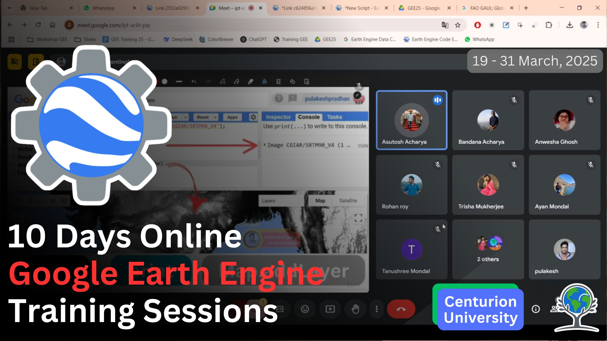

I maintain several dedicated course sites covering various aspects of spatial data science, programming, and academic tools.

## 💻 Geospatial Programming

::: {.course-grid}

::: {.course-card}

::: {.course-card-body}
### R for Spatial Analysis
Comprehensive guide to handling vector and raster data using R (*sf*, *terra*, *stars*).

::: {.card-footer}
[<i class="bi bi-book"></i> Visit Course](https://pulakeshpradhan.github.io/rspatial/){.social-btn .stretched-link}
:::
:::
:::

::: {.course-card}

::: {.course-card-body}
### Google Earth Engine
Interactive guide and documentation for mastering cloud-based remote sensing.

::: {.card-footer}
[<i class="bi bi-book"></i> Visit Course](https://pulakeshpradhan.github.io/gee/intro.html){.social-btn .stretched-link}
:::
:::
:::

::: {.course-card}

::: {.course-card-body}
### Geo-Python
Learning spatial data science with Python using *Geopandas*, *Rasterio*, and *Xarray*.

::: {.card-footer}
[<i class="bi bi-book"></i> Visit Course](https://pulakeshpradhan.github.io/geopython/){.social-btn .stretched-link}
:::
:::
:::

:::

## 🚀 GIS & Spatial Reference

::: {.course-grid}

::: {.course-card}

::: {.course-card-body}
### Cloud GIS & AI
Resources on merging cloud computing with artificial intelligence for advanced GIS.

::: {.card-footer}
[<i class="bi bi-book"></i> Visit Course](https://pulakeshpradhan.github.io/cloudgis/){.social-btn .stretched-link}
:::
:::
:::

::: {.course-card}

::: {.course-card-body}
### Geospatial Reference
A quick-reference guide for common geospatial operations in Python, R, and GEE.

::: {.card-footer}
[<i class="bi bi-book"></i> Visit Course](https://pulakeshpradhan.github.io/geospatial/){.social-btn .stretched-link}
:::
:::
:::

:::

## ✍️ Academic Writing & Tools

::: {.course-grid}

::: {.course-card}

::: {.course-card-body}
### English for Academics
Essential resources for scientific writing, presentations, and clear academic communication.

::: {.card-footer}
[<i class="bi bi-book"></i> Visit Course](https://pulakeshpradhan.github.io/english/){.social-btn .stretched-link}
:::
:::
:::

::: {.course-card}

::: {.course-card-body}
### LaTeX for Geographers
Professional document composition and high-quality thesis writing using LaTeX.

::: {.card-footer}
[<i class="bi bi-book"></i> Visit Course](https://pulakeshpradhan.github.io/latex/){.social-btn .stretched-link}
:::
:::
:::

:::
