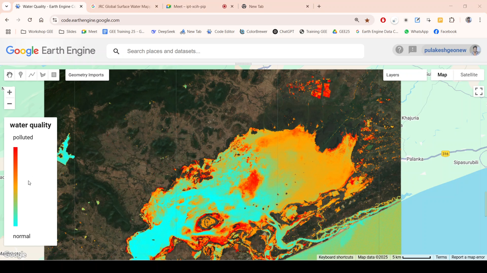
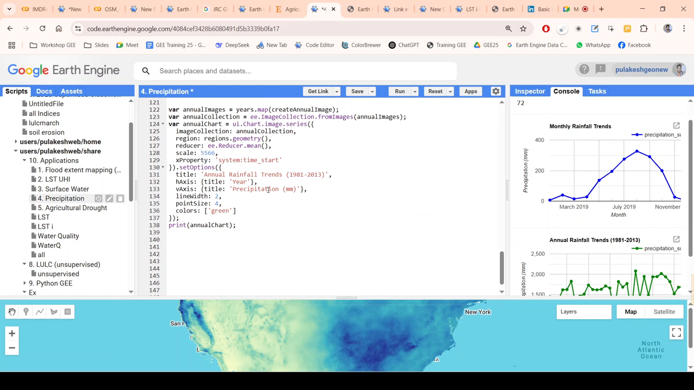
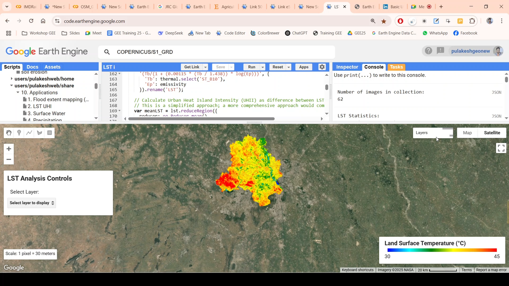
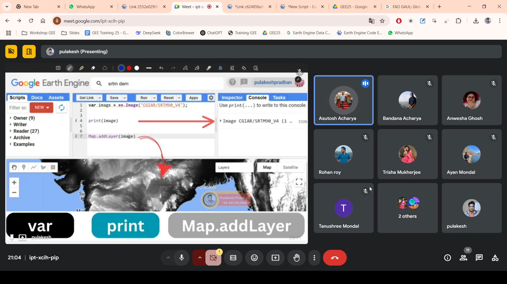
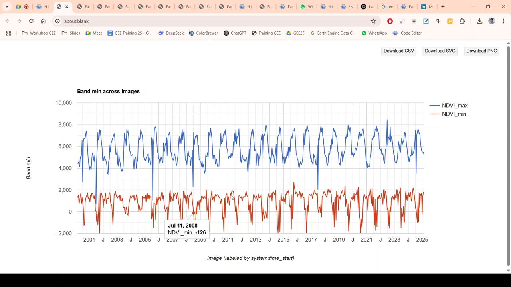
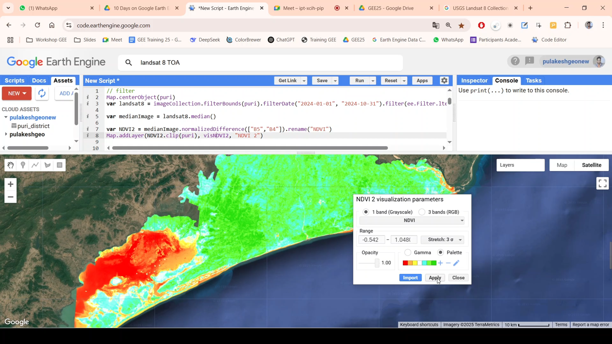
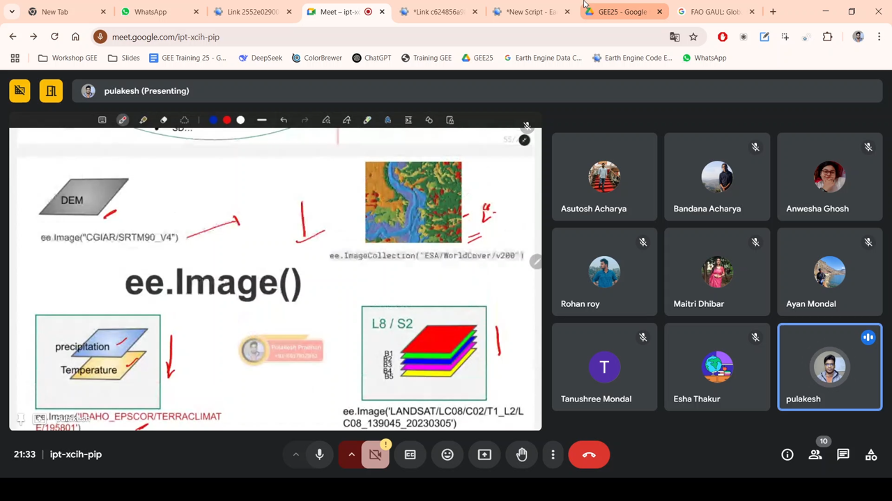
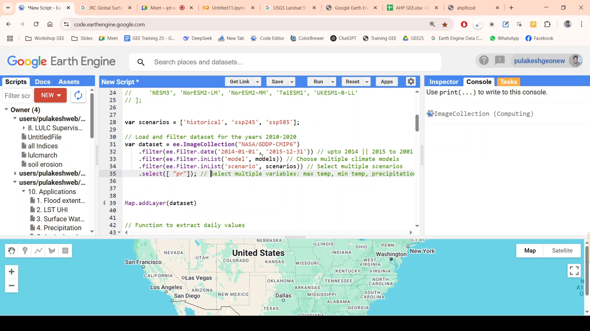

**Topic:** Google Earth Engine (GEE) Training Sessions  
**Resource Person:** Pulakesh Pradhan  
**Host:** Centurion University, Bhubaneswar  
**Status:** Successfully Concluded!

Delighted to share a few glimpses from the recently concluded 10-day Google Earth Engine (GEE) Training, where I had the privilege of leading and teaching as a resource person. 

This training, conducted by **Centurion University, Bhubaneswar**, provided participants with hands-on experience in geospatial data processing, remote sensing, and cloud-based geospatial analytics using Google Earth Engine.

## 📸 Glimpses of Training Outcomes

::: {layout-ncol=3}

:::

## 🚀 Key Learning Modules

Throughout the training, participants explored:

✅ **Cloud computing** for geospatial analysis using JavaScript  
✅ **Data handling** in GEE (FeatureCollections, ImageCollections)  
✅ **Importing and exporting** geospatial datasets (shapefiles, raster images, etc.)  
✅ **GEE functionalities**: filtering, reducers, time-series analysis, and charting  
✅ **Machine learning** for Land Use Land Cover (LULC) classification  
✅ **Applications**: Urban Heat Island, Flood Mapping, Forest Monitoring, Surface Water Detection, Water Quality, etc.  
✅ **Key datasets covered**: Landsat, Sentinel-2, SRTM, FAO GAUL, TerraClimate, CHIRPS, MODIS, CMIP6, etc.  
✅ **Advanced Integration**: AI, IMD data, and OpenStreetMap (OSM) in GEE

🙏 A huge appreciation to all participants for their dedication and active engagement. Your enthusiasm made this learning experience truly enriching!

#GoogleEarthEngine #RemoteSensing #GeospatialAnalysis #EarthObservation #DataScience #MachineLearning #ClimateAnalysis #SustainableDevelopment

---

📌 More insights: [LinkedIn Article](https://www.linkedin.com/pulse/glimpse-10-day-online-google-earth-engine-gee-training-pradhan-owdwc) | [pulakeshpradhan.github.io](https://pulakeshpradhan.github.io)
