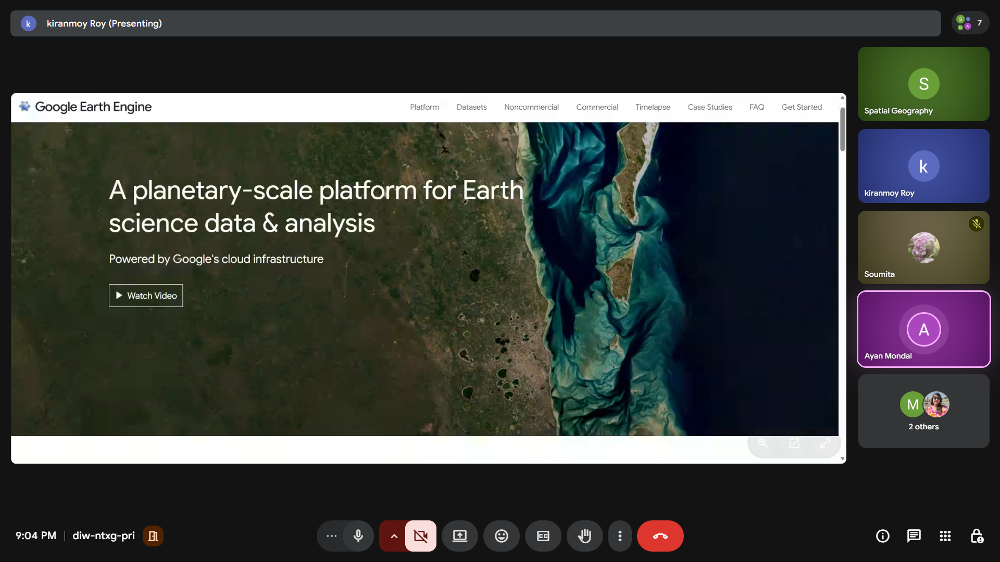
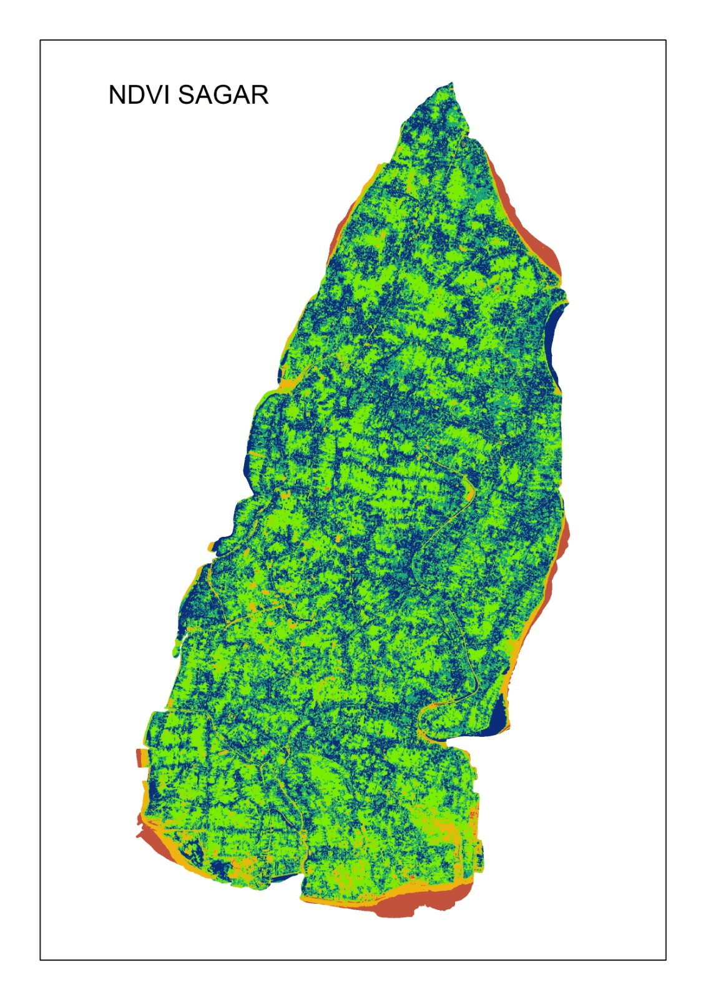
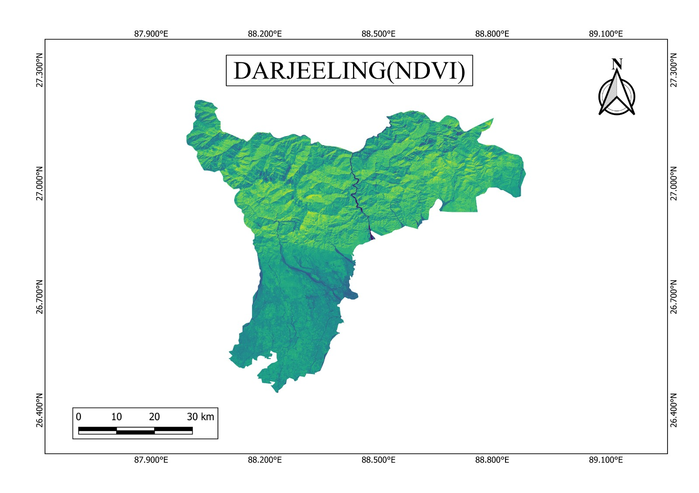
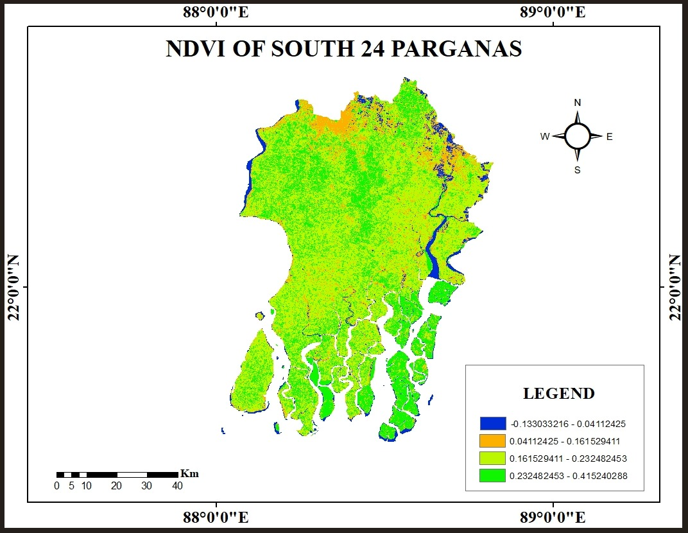

**Topic:** Basics of Google Earth Engine  
**Trainer:** Pulakesh Pradhan  
**Mode:** Virtual (Online)  
**Host:** Centurion University, Bhubaneswar  

## Workshop Highlights

The 5-day intensive workshop at Centurion University provided PG students with a solid foundation in Google Earth Engine. Attendees explored diverse applications, from basic scripting to advanced geospatial analysis.

::: {layout-ncol=2}

:::

## Schedule

The workshop was held from **7:00 PM to 9:30 PM** on the following dates:

- **Monday, Feb 16, 2026**
- **Wednesday, Feb 18, 2026**
- **Thursday, Feb 19, 2026**
- **Saturday, Feb 21, 2026**
- **Sunday, Feb 22, 2026**

This intensive session was designed for PG students to build a strong foundation in Google Earth Engine for geospatial analysis.

