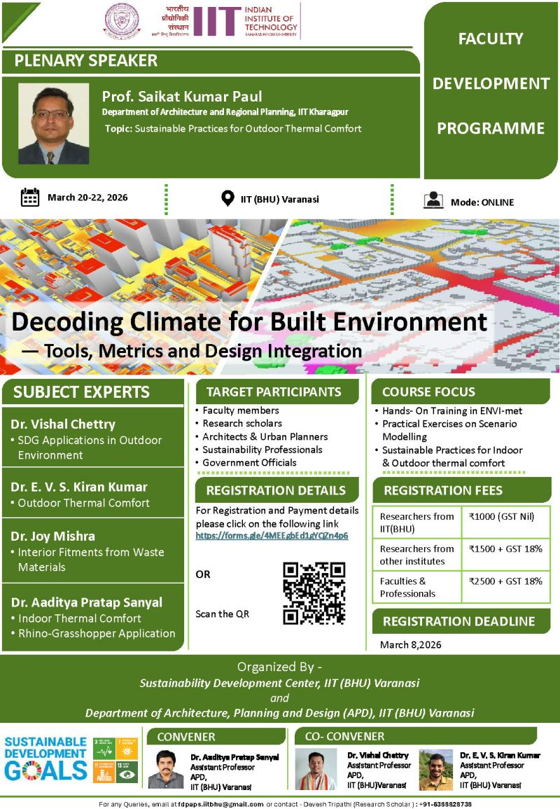

🎯 **Online Faculty Development Programme (FDP) on Decoding Climate for Built Environment — Tools, Metrics and Design Integration** 🌍

We are pleased to announce an **ONLINE** FDP jointly organized by Sustainability Development Center, IIT (BHU) Varanasi and Department of Architecture, Planning and Design, IIT (BHU) Varanasi. This program is designed to bridge the gap between architectural design and environmental performance through advanced tools and metrics.

- **📅 Date:** 20–22 March 2026
- **💻 Mode:** Online
- **🏛 Organised by:** Sustainability Development Center & Dept. of Architecture, Planning and Design, IIT (BHU) Varanasi

## 🔍 Key Focus Areas
*   **Application of Sustainable Development Goals (SDG)** for Built Environment
*   **Environmental Simulation** workflows
*   **Climate responsive design** using Ladybug Tools
*   **Integration of Design** with Environmental performance

## 📜 Certification & Benefits
*   E-Certificate will be awarded to all successful participants.
*   Hands-on insights into modern environmental simulation tools.

## 💰 Registration Fee
*   Refer to the event poster for detailed fee structure and participation guidelines.

## 🔗 Registration
[**Register Now: https://docs.google.com/forms/d/e/1FAIpQLSfo9ySbu2b-PTn3ezmOguvCTFa2uiTj_U0TWPRkxFRqxqlqig/viewform**](https://docs.google.com/forms/d/e/1FAIpQLSfo9ySbu2b-PTn3ezmOguvCTFa2uiTj_U0TWPRkxFRqxqlqig/viewform)

📢 Join this FDP to master climate-responsive design strategies and environmental performance integration.

