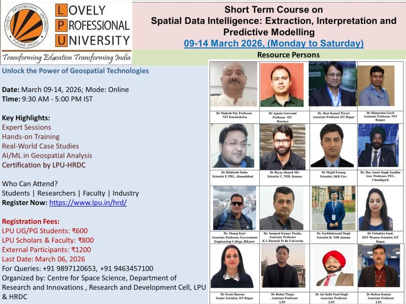

🚀 **Short Term Course on Spatial Data Intelligence: Extraction, Interpretation and Predictive Modelling** 🌍

We are pleased to announce an **ONLINE** Short Term Course designed to strengthen competencies in spatial data intelligence and geospatial analytics, with emphasis on data extraction, interpretation, and predictive modelling.

- **📅 Date:** 09–14 March 2026 (Monday to Saturday)
- **🕘 Time:** 9:30 AM – 5:00 PM (IST)
- **💻 Mode:** Online
- **🏛 Organised by:** Centre for Space Science, Department of Research and Innovations, Research and Development Cell, Lovely Professional University (LPU)

## ✨ Course Highlights
🔹 Expert sessions by eminent academicians and scientists  
🔹 Hands-on training with real-world datasets  
🔹 AI/ML-based predictive modelling in geospatial analysis  
🔹 Practical workflows and case studies  
🔹 Certification by LPU–HRDC  

## 👥 Who Should Attend?
Students | Research Scholars | Faculty | Industry Professionals

## 💰 Registration Fees
• **LPU UG/PG Students:** ₹600  
• **LPU Scholars & Faculty:** ₹800  
• **External Participants (Students / Scholars / Faculty / Industry):** ₹1,200  

## 🔗 Registration
[**Register Now: https://www.lpu.in/hrd/**](https://www.lpu.in/hrd/)

📢 Join this intensive, fully online short-term course to upskill in spatial data intelligence and engage with leading national experts.

