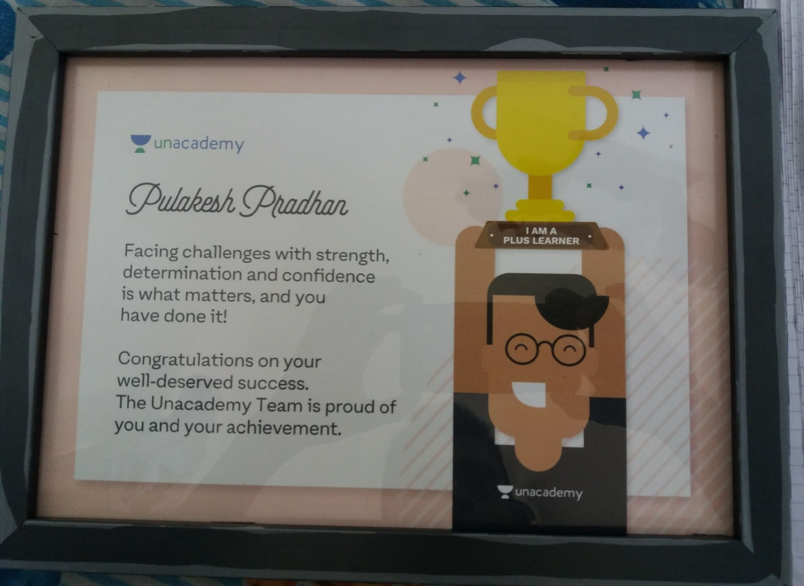
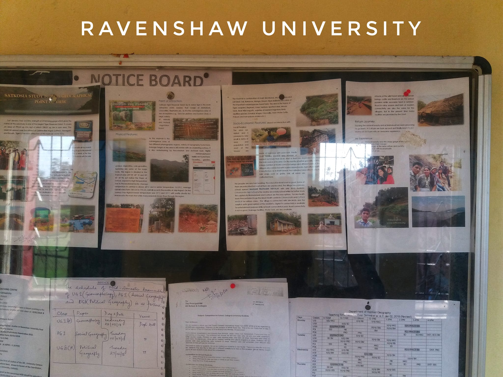

Welcome to my academic and field journey. This gallery showcases my participation in research conventions, workshops, and institutional visits. Click on any image to expand.

::: {.gallery-grid}

::: {.gallery-item}
[{.lightbox group="gallery" description="Department of Geography campus views"}](images/Ravenshaw/rugeo1.jpeg)

::: {.gallery-caption}
**Ravenshaw University**  
Department of Geography
:::
:::

::: {.gallery-item}
[{.lightbox group="gallery" description="Academic research environment"}](images/Ravenshaw/rugeo2.jpeg)

::: {.gallery-caption}
**Ravenshaw University**  
Academic research environment
:::
:::

::: {.gallery-item}
[{.lightbox group="gallery" description="Collaborative research visit"}](images/IIT%20Bombay/1.jpg)

::: {.gallery-caption}
**IIT Bombay**  
GROW Event 2025
:::
:::

::: {.gallery-item}
[{.lightbox group="gallery" description="Field study discussion"}](images/IIT%20Bombay/2.jpg)

::: {.gallery-caption}
**IIT Bombay**  
Poster Presentation at GROW Event
:::
:::

::: {.gallery-item}
[{.lightbox group="gallery" description="Student Research Convention"}](images/Ravenshaw/1.jpg)

::: {.gallery-caption}
**ANVESHAN 2023**  
Student Research Convention
:::
:::

::: {.gallery-item}
[{.lightbox group="gallery" description="Recognizing spatial research excellence"}](images/Ravenshaw/2.jpg)

::: {.gallery-caption}
**Award Ceremony**  
Sky is the limit...
:::
:::

::: {.gallery-item}
[{.lightbox group="gallery" description="Banaras Hindu University training session"}](images/BHU/BHU4.jpg)

::: {.gallery-caption}
**BHU GEE Workshop**  
Banaras Hindu University session
:::
:::

::: {.gallery-item}
[{.lightbox group="gallery" description="Practical GIS applications"}](images/BHU/BHU3.jpg)

::: {.gallery-caption}
**Field Data Collection**  
Practical GIS applications
:::
:::

::: {.gallery-item}
[{.lightbox group="gallery" description="Gujarat technical workshop"}](images/Ganpat%20University/guni1.jpeg)

::: {.gallery-caption}
**AIU Anveshan 2023**  
Ganpat University
:::
:::

::: {.gallery-item}
[{.lightbox group="gallery" description="GUNI research talk"}](images/Ganpat%20University/guni4.JPG)

::: {.gallery-caption}
**AIU Anveshan 2023**  
Ganpat University
:::
:::

::: {.gallery-item}
[{.lightbox group="gallery" description="Ranchi University conference"}](images/NAGI/NAGI1.jpg)

::: {.gallery-caption}
**NAGI Congress**  
Ranchi University conference
:::
:::

::: {.gallery-item}
[{.lightbox group="gallery" description="NAGI Technical session"}](images/NAGI/NAGI3.jpg)

::: {.gallery-caption}
**Cartographic Expert Group**  
NAGI Technical session
:::
:::

::: {.gallery-item}
[{.lightbox group="gallery" description="Gemini AI Presentation"}](images/gdg.jpg)

::: {.gallery-caption}
**GDG Earth Engine Nairobi**  
Gemini AI Presentation
:::
:::

::: {.gallery-item}
[{.lightbox group="gallery" description="MSBD University training"}](images/resource2.jpg)

::: {.gallery-caption}
**Resource Person**  
Maharaja Sriram Chandra Bhanja Deo University
:::
:::

::: {.gallery-item}
[{.lightbox group="gallery" description="Unacademy Plus Learner Certificate"}](images/Random/3.jpg)

::: {.gallery-caption}
**Unacademy**  
Plus Learner Certificate
:::
:::

::: {.gallery-item}
[{.lightbox group="gallery" description="Ravenshaw University Notice Board"}](images/Random/2.jpg)

::: {.gallery-caption}
**Ravenshaw University**  
Notice Board
:::
:::

:::

