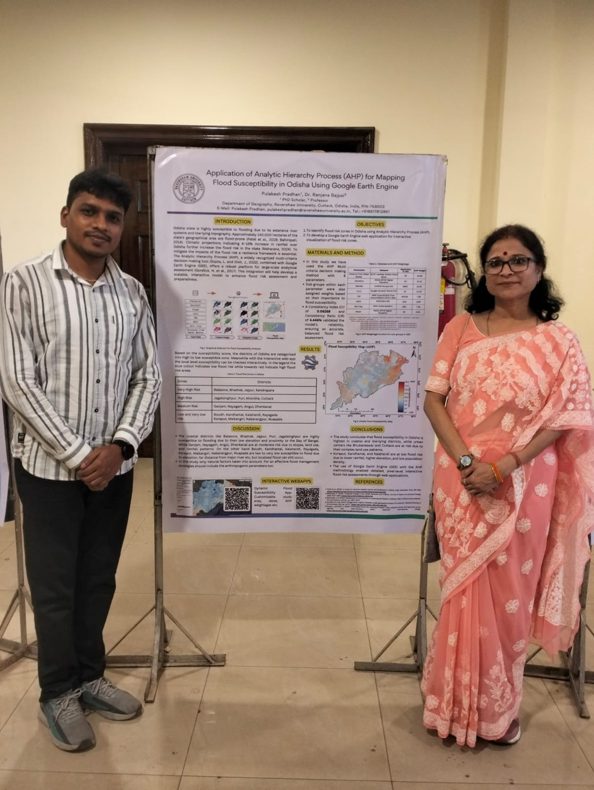
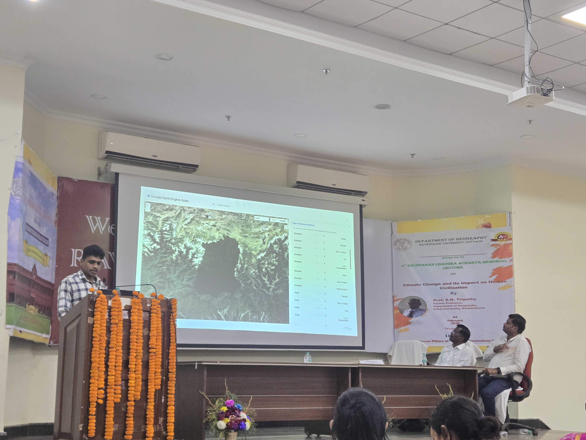
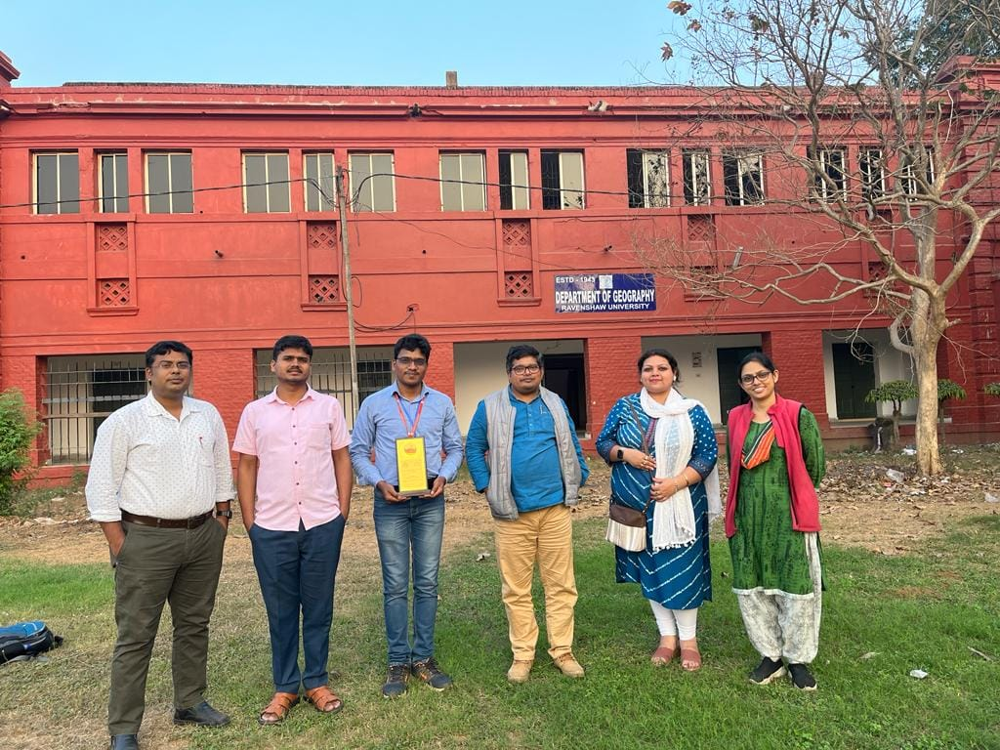
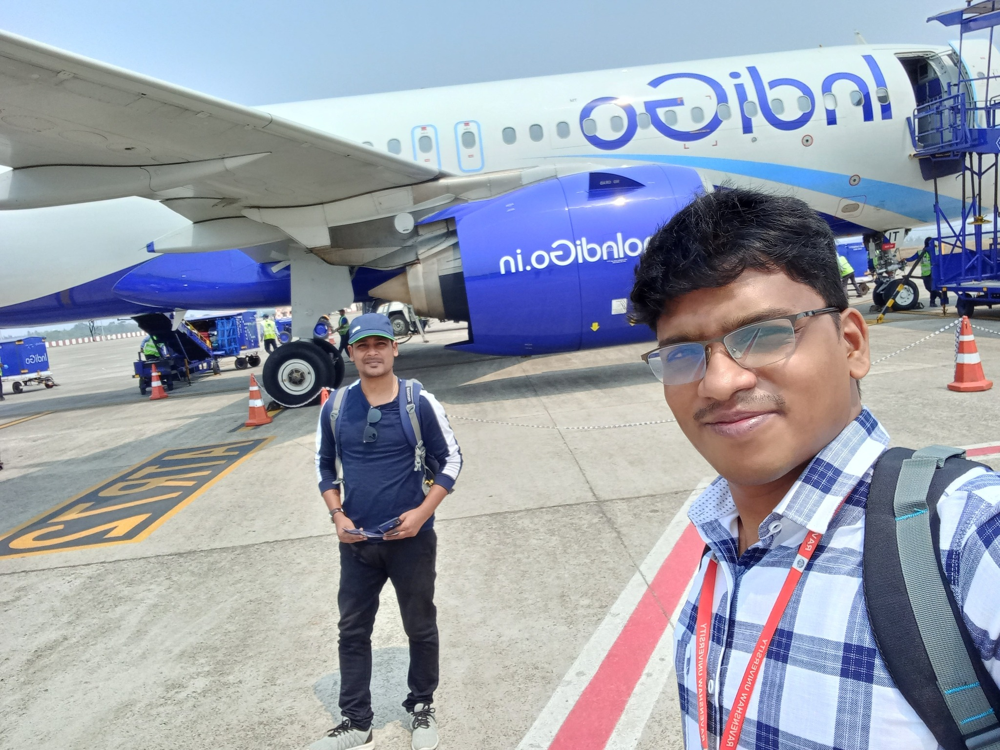
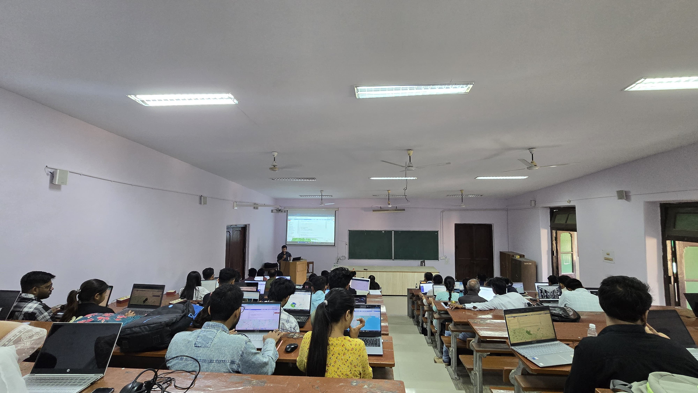
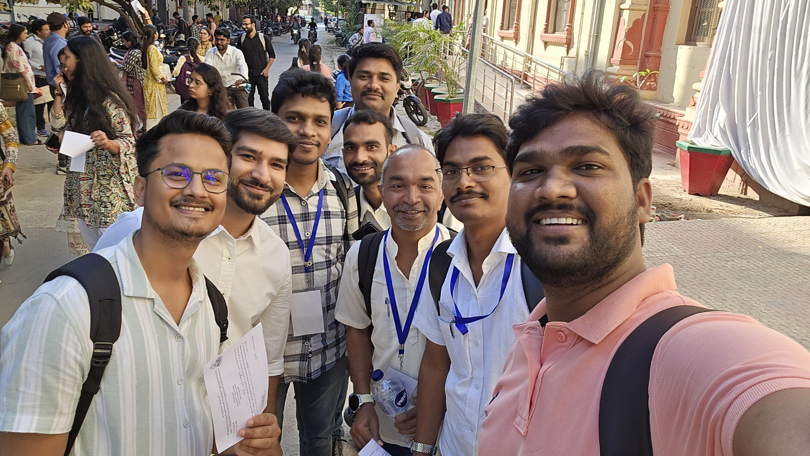
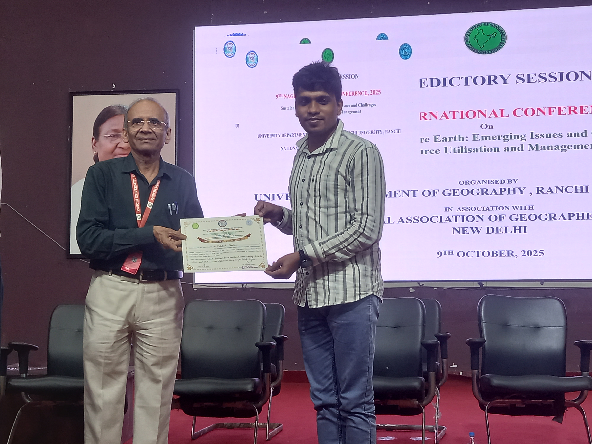
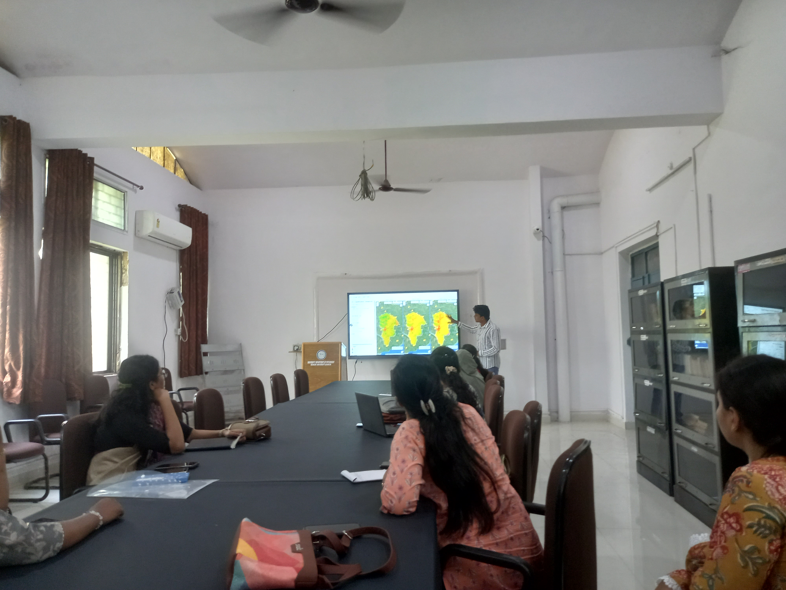
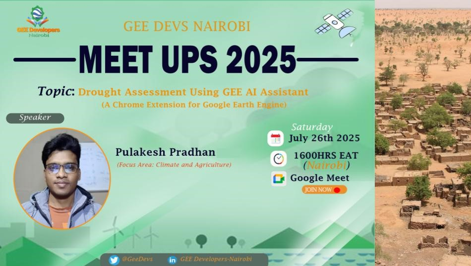
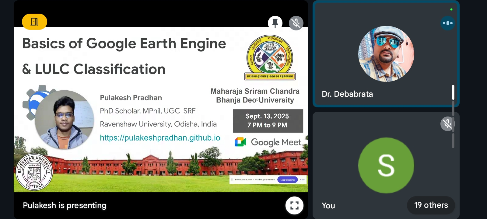

Welcome to my academic and field journey. This gallery showcases my participation in research conventions, workshops, and institutional visits. Click on any image to expand.

## 🏢 Institutional Highlights

::: {layout-ncol=2}
{.lightbox group="inst"}
{.lightbox group="inst"}
{.lightbox group="inst"}
{.lightbox group="inst"}
:::

## 🎓 Research Conventions

::: {layout-ncol=2}
{.lightbox group="anveshan"}
{.lightbox group="anveshan"}
:::

## 🌍 Workshops & Field Work

::: {layout-ncol=2}
{.lightbox group="workshops"}
{.lightbox group="workshops"}
{.lightbox group="workshops"}
{.lightbox group="workshops"}
:::

## 🤝 Academic Meetings

::: {layout-ncol=2}
{.lightbox group="nagi"}
{.lightbox group="nagi"}
:::

## ✨ Key Engagements

::: {layout-ncol=2}
{.lightbox group="featured"}
{.lightbox group="featured"}
:::
