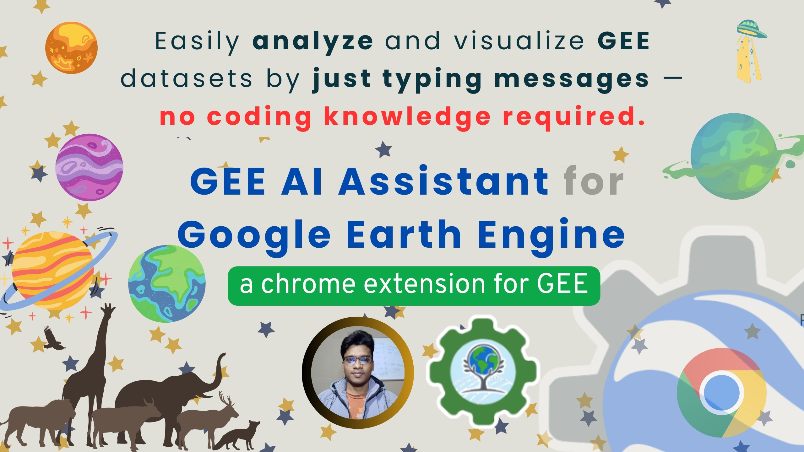
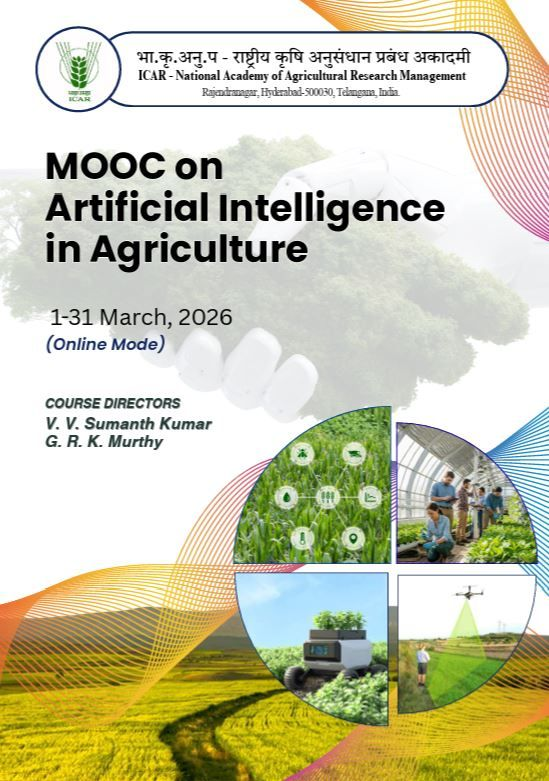
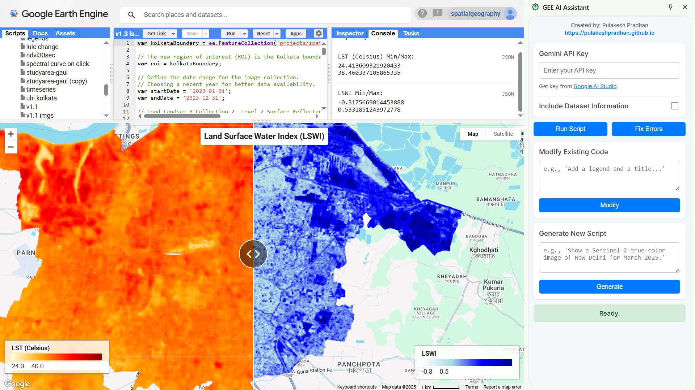

My work involves developing open-source tools, cloud applications, and browser extensions to streamline geospatial workflows for researchers and data scientists.

::: {.innovation-section}

## 🌍 Earth Engine Apps

::: {.innovation-grid}

::: {.innovation-card}

::: {.innovation-card-label}
Spectral Reflectance Curve
:::

::: {.innovation-card-desc}
Advanced tool for analyzing spectral signatures across multiple bands for land cover characterization.
:::

::: {.innovation-card-links}
[<i class="bi bi-rocket-takeoff"></i> App](https://spatialgeography.projects.earthengine.app/view/spectral){.social-btn .stretched-link} [<i class="bi bi-github"></i> GitHub](https://github.com/pulakeshpradhan/){.social-btn}
:::

:::

::: {.innovation-card}

::: {.innovation-card-label}
Phenology Signature
:::

::: {.innovation-card-desc}
Automating crop classification using multi-temporal phenological patterns and signature analysis.
:::

::: {.innovation-card-links}
[<i class="bi bi-rocket-takeoff"></i> App](https://spatialgeography.projects.earthengine.app/view/signature){.social-btn .stretched-link} [<i class="bi bi-github"></i> GitHub](https://github.com/pulakeshpradhan/){.social-btn}
:::

:::

::: {.innovation-card}

::: {.innovation-card-label}
Flood Susceptibility
:::

::: {.innovation-card-desc}
Analytic Hierarchy Process (AHP) implementation for rigorous regional flood vulnerability mapping.
:::

::: {.innovation-card-links}
[<i class="bi bi-rocket-takeoff"></i> App](https://spatialgeography.projects.earthengine.app/view/floodsusceptibility){.social-btn .stretched-link} [<i class="bi bi-github"></i> GitHub](https://github.com/pulakeshpradhan/){.social-btn}
:::

:::

::: {.innovation-card}

::: {.innovation-card-label}
Odisha Flood Map
:::

::: {.innovation-card-desc}
Real-time monitoring and visualization of flood extent using SAR and multi-spectral satellite imagery.
:::

::: {.innovation-card-links}
[<i class="bi bi-rocket-takeoff"></i> App](https://spatialgeography.projects.earthengine.app/view/odishaflood){.social-btn .stretched-link} [<i class="bi bi-github"></i> GitHub](https://github.com/pulakeshpradhan/){.social-btn}
:::

:::

:::

## 📦 Python Packages

::: {.innovation-grid}

::: {.innovation-card}

::: {.innovation-card-label}
geeadvance
:::

::: {.innovation-card-desc}
A Python package for functional programming utilities to streamline Earth Engine API workflows.
:::

::: {.innovation-card-links}
[<i class="bi bi-box-seam"></i> PyPI](https://pypi.org/project/geeadvance/){.social-btn .stretched-link} [<i class="bi bi-github"></i> GitHub](https://github.com/pulakeshpradhan/geeadvance){.social-btn}
:::

:::

::: {.innovation-card}

::: {.innovation-card-label}
deepgee
:::

::: {.innovation-card-desc}
Bridge GEE datasets with Deep Learning models for automated satellite imagery classification.
:::

::: {.innovation-card-links}
[<i class="bi bi-box-seam"></i> PyPI](https://pypi.org/project/deepgee/){.social-btn .stretched-link} [<i class="bi bi-github"></i> GitHub](https://github.com/pulakeshpradhan/deepgee){.social-btn}
:::

:::

::: {.innovation-card}

::: {.innovation-card-label}
geeassist
:::

::: {.innovation-card-desc}
Small Python library to interact with LLMs for generating and debugging GEE code snippets.
:::

::: {.innovation-card-links}
[<i class="bi bi-box-seam"></i> PyPI](https://pypi.org/project/geeassist/){.social-btn .stretched-link} [<i class="bi bi-github"></i> GitHub](https://github.com/pulakeshpradhan/geeassist){.social-btn}
:::

:::

:::

## 📚 R Library

::: {.innovation-grid}

::: {.innovation-card}

::: {.innovation-card-label}
rpygee
:::

::: {.innovation-card-desc}
An R wrapper providing a seamless interface to run Google Earth Engine via the Python API.
:::

::: {.innovation-card-links}
[<i class="bi bi-book"></i> Docs](https://pulakeshpradhan.github.io/rpygee/){.social-btn .stretched-link} [<i class="bi bi-github"></i> GitHub](https://github.com/pulakeshpradhan/rpygee){.social-btn}
:::

:::

:::

## 🛠️ Extensions & Tools

::: {.innovation-grid}

::: {.innovation-card}

::: {.innovation-card-label}
GEE AI Assistant
:::

::: {.innovation-card-desc}
Chrome extension that integrates Gemini AI directly into the GEE Code Editor for rapid scripts.
:::

::: {.innovation-card-links}
[<i class="bi bi-browser-chrome"></i> Store](https://chromewebstore.google.com/detail/gee-ai-assistant/kldhacnbicjpbdiebjjflnhgcmheokkl){.social-btn .stretched-link} [<i class="bi bi-github"></i> GitHub](https://github.com/pulakeshpradhan/gee-ai-assistant){.social-btn}
:::

:::

::: {.innovation-card}

::: {.innovation-card-label}
Quick Screenshot
:::

::: {.innovation-card-desc}
Browser tool for high-resolution geospatial map capture, optimized for academic publication.
:::

::: {.innovation-card-links}
[<i class="bi bi-browser-chrome"></i> Store](https://chromewebstore.google.com/detail/koeblknkgkpklkpcbfigakkfnhkkadnm){.social-btn .stretched-link}
:::

:::

:::

:::
