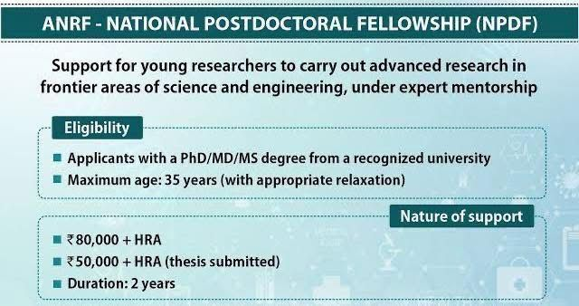

::: {.column-page}

## 💼 Opportunities in GIS & Geospatial Science

Below is a curated list of job openings and research opportunities in the fields of Geography, GIS, Remote Sensing, and Spatial Data Science.

::: {.social-card style="display: grid; grid-template-columns: 2fr 1fr; gap: 20px; border: 1px solid rgba(0,0,0,0.05); padding: 25px; border-radius: 16px; margin-bottom: 40px; background: #fffbeb; box-shadow: 0 4px 15px rgba(0,0,0,0.02);"}
::: {.social-content}
### Assistant Professor Recruitment (WBCSC)
**📍 Organization:** West Bengal College Service Commission | **💻 Mode:** Online
**📜 Advt. No:** 1/2026 | **📅 Posted:** February 2026

The West Bengal College Service Commission invites applications for the posts of **Assistant Professor** in Government-Aided Degree Colleges of West Bengal.

**📅 Application Deadline:** 15th April, 2026

[Apply Online](http://www.wbcsconline.in){style="background: #92400e; border: 1px solid rgba(0,0,0,0.1); padding: 8px 16px; border-radius: 50px; text-decoration: none; color: white; font-weight: 600; font-size: 0.9rem;"}
[View Details](jobs/wbcsc-asst-prof-2026.qmd){style="background: rgba(255,255,255,0.7); border: 1px solid rgba(0,0,0,0.1); padding: 8px 16px; border-radius: 50px; text-decoration: none; color: #92400e; font-weight: 600; font-size: 0.9rem;"}

:::
::: {.social-media style="display: flex; align-items: center;"}
[{style="border-radius: 12px; width: 100%; box-shadow: 0 5px 15px rgba(0,0,0,0.08);"}](jobs/wbcsc-asst-prof-2026.qmd)
:::
:::

::: {.social-card style="display: grid; grid-template-columns: 2fr 1fr; gap: 20px; border: 1px solid rgba(0,0,0,0.05); padding: 25px; border-radius: 16px; margin-bottom: 40px; background: #f8fafc; box-shadow: 0 4px 15px rgba(0,0,0,0.02); opacity: 0.8;"}
::: {.social-content}
### Assistant Professor Recruitment (WBCSC) - 2020
**📍 Organization:** West Bengal College Service Commission | **💻 Mode:** Online
**📜 Advt. No:** 1/2020 | **📅 Dated:** December 2020

Archived recruitment notice for Assistant Professor posts in State-Aided Degree Colleges of West Bengal.

**📅 Application Deadline:** 15th February, 2021

[View Details](jobs/wbcsc-asst-prof-2020.qmd){style="background: rgba(255,255,255,0.7); border: 1px solid rgba(0,0,0,0.1); padding: 8px 16px; border-radius: 50px; text-decoration: none; color: #64748b; font-weight: 600; font-size: 0.9rem;"}

:::
::: {.social-media style="display: flex; align-items: center;"}
[{style="border-radius: 12px; width: 100%; box-shadow: 0 5px 15px rgba(0,0,0,0.08); filter: grayscale(1);"}](jobs/wbcsc-asst-prof-2020.qmd)
:::
:::

###  Quick Summary of Openings

| Position | Organization | Location | Deadline | Action |
| :--- | :--- | :--- | :--- | :--- |
| **Assistant Professor (2026)** | WBCSC | West Bengal | April 15, 2026 | [View Details](jobs/wbcsc-asst-prof-2026.qmd) |
| **Assistant Professor (2020)** | WBCSC | West Bengal | Feb 15, 2021 | [View Details](jobs/wbcsc-asst-prof-2020.qmd) |

 

#### 🔍 External Job Alerts & Resources

::: {.grid}

::: {.g-col-12 .g-col-md-6}
::: {.social-card style="display: flex; align-items: center; gap: 15px; padding: 15px; background: #f0fdf4; border: 1px solid #dcfce7; border-radius: 12px; height: 100%; transition: transform 0.2s;"}
<i class="bi bi-briefcase" style="font-size: 1.5rem; color: #16a34a;"></i>

**FreeJobAlert**  
[Teaching & Faculty Jobs](https://www.freejobalert.com/teaching-faculty-jobs/)  
*Latest updates on academic vacancies.*

:::
:::

::: {.g-col-12 .g-col-md-6}
::: {.social-card style="display: flex; align-items: center; gap: 15px; padding: 15px; background: #f0f9ff; border: 1px solid #e0f2fe; border-radius: 12px; height: 100%; transition: transform 0.2s;"}
<i class="bi bi-youtube" style="font-size: 1.5rem; color: #dc2626;"></i>

**YouTube Resource**  
[Saroj Mishra Tutorial](https://www.youtube.com/@SarojMishraTutorial/videos)  
*Detailed guides and job explanations.*

:::
:::

:::

## 📊 Short-listing Criteria for Assistant Professors

Use the sections below to evaluate your score for both Colleges and Universities.

::: {.panel-tabset}

### 🏫 Criteria for Colleges

| S.N. | Criteria | Max Marks | Marks Distribution | Obtained |
|:---:|:---|:---:|:---|:---:|
| 1 | Graduation | 21 | 80% & Above = 21; 60% to < 80% = 19; 55% to < 60% = 16; 45% to < 55% = 10 | 16 (-5) |
| 2 | Post-Graduation | 25 | 80% & Above = 25; 60% to < 80% = 23; 55% (50% for SC/ST/OBC/PWD) to < 60% = 20 | 25 |
| 3 | M.Phil. | 07 | 60% & above = 07; 55% to < 60% = 05 | 07 |
| 4 | Ph.D. | 25 | After PhD = 78/84 | 18+ |
| 5 | NET with JRF | 10 | | 10 |
| 6 | NET | 08 | | |
| 7 | SLET/SET | 05 | | |
| 8 | Research Publications | 06 | 2 marks for each publication in Peer-Reviewed or UGC-listed Journals | 06+ |
| 9 | Teaching / Post Doctoral | 10 | 2 marks for one year each | 10+ |
| 10 | Awards (Intl./National) | 03 | Awards given by Intl. Orgs / Govt. of India / Recognized Bodies | |
| 11 | Awards (State-Level) | 02 | Awards given by State Government | 02 (-1) |
| | **TOTAL** | **100** | | **60 / 66** |

> [!TIP]
> **Summary (Colleges):**
> *   **Note (A):** (i) M.Phil. + Ph.D. Max: **25 Marks**; (ii) JRF/NET/SET Max: **10 Marks**; (iii) Awards Max: **03 Marks**
> *   **Academic Score:** 84 | **Research:** 06 | **Teaching:** 10 | **Total:** 100

---

### 🎓 Criteria for Universities

| S.N. | Criteria | Max Marks | Marks Distribution | Obtained |
|:---:|:---|:---:|:---|:---:|
| 1 | Graduation | 15 | 80% & Above = 15; 60% to < 80% = 13; 55% to < 60% = 10; 45% to < 55% = 05 | 13 (-2) |
| 2 | Post-Graduation | 25 | 80% & Above = 25; 60% to < 80% = 23; 55% (50% for SC/ST/OBC/PWD) to < 60% = 20 | 25 |
| 3 | M.Phil. | 07 | 60% & above = 07; 55% to < 60% = 05 | 07 |
| 4 | Ph.D. | 30 | After PhD = 77/80 | 23+ |
| 5 | NET with JRF | 07 | | 07 |
| 6 | NET | 05 | | |
| 7 | SLET/SET | 03 | | |
| 8 | Research Publications | 10 | 2 marks for each publication in Peer-Reviewed or UGC-listed Journals | 10+ |
| 9 | Teaching / Post Doctoral | 10 | 2 marks for one year each | 10+ |
| 10 | Awards (Intl./National) | 03 | Awards given by Intl. Orgs / Govt. of India / Recognized Bodies | |
| 11 | Awards (State-Level) | 02 | Awards given by State Government | 02 (-1) |
| | **TOTAL** | **100** | | **54 / 57** |

> [!TIP]
> **Summary (Universities):**
> *   **Note (A):** (i) M.Phil. + Ph.D. Max: **30 Marks**; (ii) JRF/NET/SET Max: **07 Marks**; (iii) Awards Max: **03 Marks**
> *   **Academic Score:** 80 | **Research:** 10 | **Teaching:** 10 | **Total:** 100

---

### 🧬 Criteria for N-PDF

::: {.grid}

::: {.g-col-12 .g-col-md-6}

#### 📝 N-PDF Eligibility

| Requirement | Detail |
|:---|:---|
| **Age Limit** | **35 Years** (Standard) |
| **Publications** | **[2 Articles (SCI Indexed)](journals.qmd)** |

{width="100%" .rounded .shadow-sm}

#### 🏛️ Essential Qualifications

*   **Master's Degree**: Min. **55% marks** in relevant subject.
*   **National Tests**: Must have cleared **UGC NET / CSIR NET / SLET / SET**.
*   **Ph.D. Alternative**: Ph.D. degree in line with **UGC Regulations 2009/2016**.
*   **Ph.D. Standards**:
    *   Awarded in **Regular mode** only.
    *   Thesis evaluated by at least **two external examiners**.
    *   **Open viva voce** conducted.
    *   Min. **two research papers** from Ph.D. (one in refereed journal).
    *   Min. **two presentations** in UGC/ICSSR/CSIR sponsored conferences.

:::

::: {.g-col-12 .g-col-md-6}

#### 🛠️ Skills & Progress Tracker

**Geospatial & Programming**

- [x] **Cloud GIS**: Google Earth Engine (GEE)
- [x] **Standards**: STAC + R + LaTeX
- [ ] **Python & Deep Learning** (CNN/LSTM/GAN)
    - *Progress: 50% Done*

  
50%

**Proposed Post-Doc Research**

> **Title:** *"Climate Change induced threats to Indian agriculture: Current state and future preparedness"*
>
> **Core Components:**
> - **Climate Data**: Analysis of historical & real-time climatic variables.
> - **Future Projections**: Multi-model ensemble analysis using **CMIP6 data**.
> - **Socio-Spatial Integration**: Marriage of social indicators with spatial vulnerabilities.
> - **Field Validation**: Primary survey of high-risk regions to assess local preparedness and adaptation strategies.

 

**Current Status Summary**

| Category | Readiness |
|:---|:---|
| **Academic** | **100%** (NET/PhD) |
| **Technical** | **75%** (GEE/R/LaTeX) |
| **A.I./M.L.** | **50%** (Python/DL) |

:::

:::

### 🎯 Career Goal

::: {.grid}

::: {.g-col-12 .g-col-md-7}
#### ✍️ Thesis Roadmap
| Milestone | Timeline | Status |
|:---|:---|:---:|
| **Draft Completion** | Summer Vacation 2026 | 🎯 Target |
| **Quality Refinement** | Final 6 Months (Buffer) | ⏳ Planned |
| **Final Submission** | Year End 2026 | 🚀 Goal |

> [!IMPORTANT]
> **Priority:** PhD thesis is critical for long-term career growth. The focus is on achieving **top-tier quality** and scientific excellence.
:::

::: {.g-col-12 .g-col-md-5}
#### 📄 Publications
| Goal | Deadline |
|:---|:---|
| **5 Paper Submissions** | **Oct 2026 (Puja Vacation)** |

**Target Focus**
- [ ] SCI Journal Indexing
- [ ] High Impact Factor
- [ ] Rigorous Peer Review
:::

:::

::: {.social-card style="background: #fff7ed; border: 2px solid #fb923c; padding: 20px; border-radius: 12px; margin-top: 20px;"}
### 🏆 Ultimate Career Target
**Position:** Assistant Professor
**Target Institutions:** **BHU / JNU / Central Universities**

> **Strategy:** The path to a Central University depends entirely on the **Quality of Research** and **Technical Skills**. Every paper and skill acquired is a step toward this excellence.
:::

:::

 

:::
