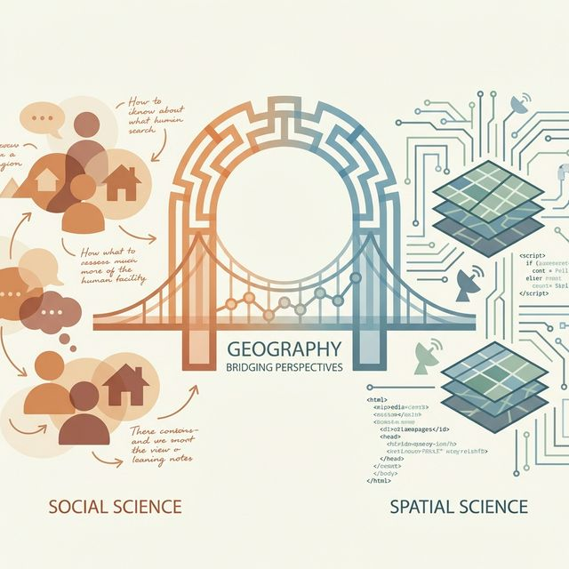
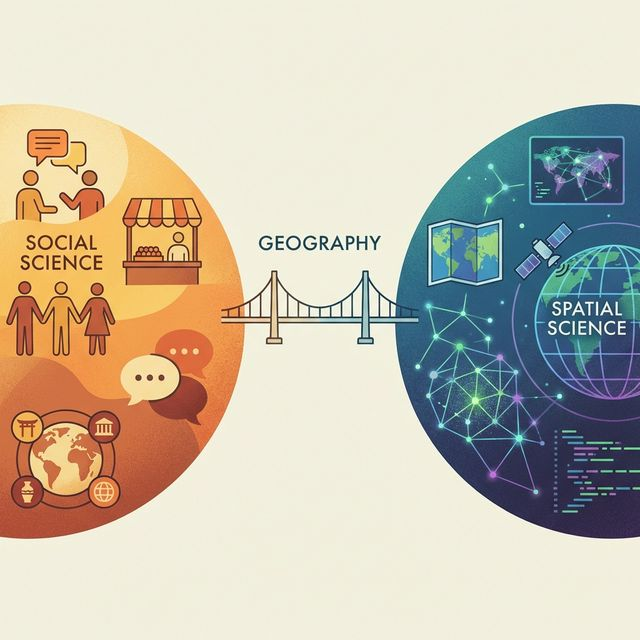
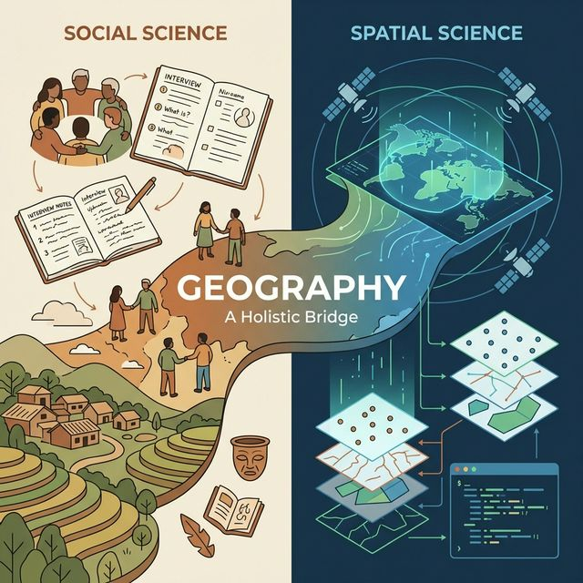
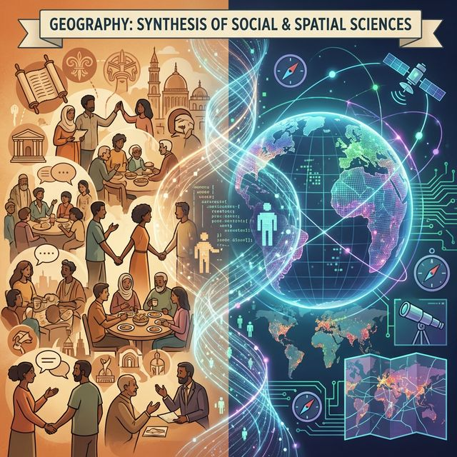

Geography is often described as the "mother of all sciences," a discipline that uniquely sits at the intersection of the natural and social worlds. But within this broad field, there exists a dynamic tension—and a powerful synergy—between two dominant paradigms: **Geography as a Social Science** and **Geography as a Spatial Science**.

## 🧠 The Social Science Perspective: Understanding "Place"

In the realm of social science, geography is deeply human. It is concerned with the **"Why"** and **"How"** of human existence in specific locations.

*   **Focus:** Lived experience, culture, politics, and social structures.
*   **Key Concept:** **"Place"** — a location imbued with meaning, memory, and social relationships.
*   **Methods:** Qualitative approaches such as ethnography, interviews, participatory observation, and critical theory.

> "Geography is not just about where things are, but about what they mean to the people who are there."

Social geographers ask questions like: *How does gentrification affect community identity?* or *What are the lived experiences of migration?*

## 🛰️ The Spatial Science Perspective: Analyzing "Space"

On the other side of the spectrum lies spatial science, often driven by the "Quantitative Revolution" of the mid-20th century. Here, geography becomes a rigorous, measurable science.

*   **Focus:** Patterns, distributions, flows, and measurable phenomena.
*   **Key Concept:** **"Space"** — an abstract, geometric surface where variables interact.
*   **Methods:** Geographic Information Systems (GIS), Remote Sensing, spatial statistics, and geocomputation.

> "Everything is related to everything else, but near things are more related than distant things." — *Waldo Tobler (First Law of Geography)*

Spatial scientists ask: *What is the optimal location for a new hospital?* or *How can we model the spread of a wildfire using satellite data?*

## 🤝 The Convergence: Why We Need Both

For a long time, these two camps were seen as opposing forces—the "quants" vs. the "quals." However, modern geography increasingly recognizes that this binary is false.

1.  **GIS needs Context:** A map of poverty rates (Spatial Science) is just data points without understanding the historical and political causes of that poverty (Social Science).
2.  **Social Theory needs Grounding:** abstract theories about inequality are more powerful when backed by rigorous spatial evidence.

### The Rise of "Critical GIS" and "Geo-Humanities"

Today, we see a blending of these worlds. **Critical GIS** scholars use spatial tools to challenge social injustices, while **Geo-Humanities** researchers use maps to tell rich, human stories.

## Conclusion

Whether you identify more as a social theorist or a spatial analyst, the strength of geography lies in its ability to synthesize. By combining the **empathy of social science** with the **precision of spatial science**, we gain a holistic understanding of our complex world.

Geography isn't just one or the other—it is the bridge between them.
