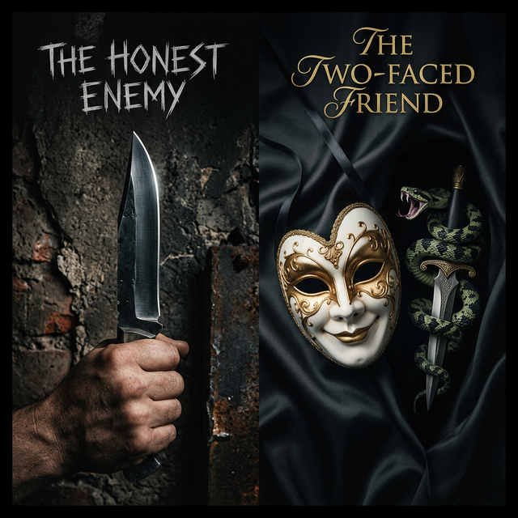

{.rounded .shadow-sm}

In the complex theatre of human relationships, we often fear the "enemy." We build walls against them, stay vigilant in their presence, and prepare for their strikes. But there is a greater danger that often goes unnoticed until it's too late: the **two-faced opportunistic friend**.

As the old saying goes: *"An honest enemy is far better than a false friend."* The reason is simple—one offers clarity, while the other offers calculated chaos.

## The Clarity of an Honest Enemy

An honest enemy is a gift of transparency. You know exactly where they stand, what they want, and why they oppose you. Their hostility is out in the open, which allows you to:

- **Build Defenses:** You don't leave your flank exposed to someone who has declared their intent to strike.
- **Drive Growth:** Often, our enemies are our most honest critics. They point out the flaws our friends are too "polite" to mention.
- **Maintain Integrity:** In a clear conflict, there is no need for performance or pretension. You are who you are, and they are who they are.

There is a certain respect in a well-defined rivalry. It is a relationship built on the truth of disagreement.

## The Danger of the Two-Faced "Friend"

The opportunistic "friend" is a master of the mask. They stand close to you not because they value you, but because you are useful—for now. Their support is a transaction, and their loyalty has an expiration date.

The danger of this type of person lies in **uncertainty**.

{style="max-width: 50%; float: right; margin-left: 20px;"}

1. **They lower your guard:** You let them into your inner circle, share your private thoughts, and expose your vulnerabilities.
2. **They drain your energy:** Negotiating with someone who is constantly calculating their "return on investment" (ROI) in the relationship is exhausting.
3. **They strike from within:** When the wind changes or a better opportunity arises elsewhere, they will not hesitate to use your shared trust as a bargaining chip.

## The Cost of Social Comfort

Why do we keep such people around? Often, it's for the sake of **social comfort**. We prefer the illusion of a friend over the reality of an enemy. We fear the "social friction" of calling out a fake friend, so we tolerate their presence until the damage is done.

But this comfort is a trap. A "friend" who expects you to be successful ONLY as long as you aren't more successful than them is not a friend. They are a competitor in disguise.

## The Path Forward: Choosing Truth over Performance

Life is too short for political navigation within your own circle. To live with impact and integrity, we must learn to value **honesty over harmony**.

- **Appreciate your enemies:** They keep you sharp, focused, and honest about your own capabilities.
- **Filter your friends:** Be ruthless with your inner circle. Loyalty is not a default; it is a character trait. Look for people who celebrate your wins without a "but," and who stay during your losses without a hidden agenda.
- **Be the honest one:** If you disagree with someone, say it. Don't be the person who smiles to a face and whispers behind a back.

## Conclusion

It is better to be hated for who you are than to be loved for the utility you provide. An enemy at the gate is a challenge to be met; a traitor in the house is a tragedy waiting to happen. 

Choose the honest blade over the hidden dagger every time.

---

*Last updated: March 2026*
