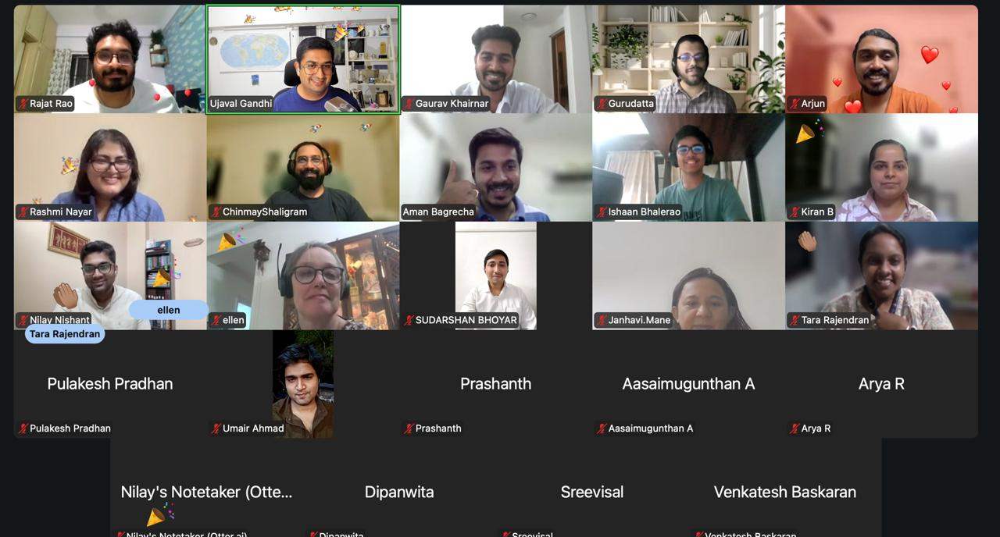

::: {.column-page}

# QGIS Resources and Materials

Welcome to the QGIS section. This area will contain resources, tutorials, and content related to Quantum GIS (QGIS).

::: {.social-card style="display: grid; grid-template-columns: 2fr 1fr; gap: 20px; border: 1px solid rgba(0,0,0,0.05); padding: 25px; border-radius: 16px; margin-top: 40px; margin-bottom: 40px; background: #f0fdf4; box-shadow: 0 4px 15px rgba(0,0,0,0.02);"}
::: {.social-content}
### QGIS India User Group

We are a community of QGIS users passionate about open-source geospatial technology. Our mission is to promote the use of QGIS, share knowledge, and support each other in our geospatial projects.

*   Shared space for QGIS users across India.
*   Encourage knowledge sharing, mentorship, and collaboration.
*   Organize local meetups, workshops, and learning initiatives.
*   Strengthen India's contribution to the global QGIS project.

[Visit Website](https://in.qgis.org/){style="background: #15803d; border: 1px solid rgba(0,0,0,0.1); padding: 8px 16px; border-radius: 50px; text-decoration: none; color: white; font-weight: 600; font-size: 0.9rem;"}
[Join Telegram](https://t.me/+YVUWbgjA320wZGU1){style="background: rgba(255,255,255,0.7); border: 1px solid rgba(0,0,0,0.1); padding: 8px 16px; border-radius: 50px; text-decoration: none; color: #166534; font-weight: 600; font-size: 0.9rem;"}

:::
::: {.social-media style="display: flex; align-items: center;"}
[{style="border-radius: 12px; width: 100%; box-shadow: 0 5px 15px rgba(0,0,0,0.08);"}](https://in.qgis.org/)
:::
:::
::: {.text-center .mt-5 .mb-4}
## Explore QGIS Ecosystem
Dive deep into the various components that make QGIS a powerful geospatial suite.
:::

::: {.grid}

::: {.g-col-12 .g-col-md-4}
::: {.card .h-100 .shadow-sm .card-hover}
::: {.card-body}
<i class="bi bi-database text-success mb-3" style="font-size: 2.5rem;"></i>

<h3 class="card-title h5">Data Management</h3>

Work with diverse data formats. Seamlessly handle Vector, Raster, and Spatial Databases like PostGIS and GeoPackage.

:::
:::
:::

::: {.g-col-12 .g-col-md-4}
::: {.card .h-100 .shadow-sm .card-hover}
::: {.card-body}
<i class="bi bi-palette text-success mb-3" style="font-size: 2.5rem;"></i>

<h3 class="card-title h5">Visualization</h3>

Craft stunning maps. Utilize advanced symbology, label engines, and the Print Layout designer to create professional map books.

:::
:::
:::

::: {.g-col-12 .g-col-md-4}
::: {.card .h-100 .shadow-sm .card-hover}
::: {.card-body}
<i class="bi bi-puzzle text-success mb-3" style="font-size: 2.5rem;"></i>

<h3 class="card-title h5">Plugins</h3>

Extend QGIS capabilities. Access hundreds of third-party plugins or write your own using the integrated Python console (PyQGIS).

:::
:::
:::

::: {.g-col-12 .g-col-md-4}
::: {.card .h-100 .shadow-sm .card-hover}
::: {.card-body}
<i class="bi bi-phone text-success mb-3" style="font-size: 2.5rem;"></i>

<h3 class="card-title h5">QField for QGIS</h3>

Take your projects to the field. QField allows for efficient, touch-friendly, and offline mobile data collection synced directly with QGIS.

:::
:::
:::

::: {.g-col-12 .g-col-md-4}
::: {.card .h-100 .shadow-sm .card-hover}
::: {.card-body}
<i class="bi bi-bar-chart-steps text-success mb-3" style="font-size: 2.5rem;"></i>

<h3 class="card-title h5">Geospatial Analysis</h3>

Perform complex spatial operations. Leverage the powerful Processing Toolbox, integrating tools from GRASS, SAGA, and GDAL.

:::
:::
:::

::: {.g-col-12 .g-col-md-4}
::: {.card .h-100 .shadow-sm .card-hover}
::: {.card-body}
<i class="bi bi-globe text-success mb-3" style="font-size: 2.5rem;"></i>

<h3 class="card-title h5">WebGIS Integration</h3>

Publish your maps online. Use tools like qgis2web or QGIS Server to create interactive web maps directly from your QGIS projects.

:::
:::
:::

:::

::: {.text-center .mt-5 .mb-4}
## QGIS Video Tutorials
A curated list of YouTube tutorials to help you master Quantum GIS from absolute beginner to advanced.
:::

::: {.grid}

::: {.g-col-12 .g-col-md-6}
::: {.card .h-100 .shadow-sm}

  <iframe src="https://www.youtube.com/embed/wo9vZccmqwc" title="QGIS 3 for Absolute Beginners" allowfullscreen></iframe>

::: {.card-body}
<h3 class="card-title h5">QGIS 3 for Absolute Beginners</h3>

A fast-paced video introducing the basics of QGIS, including the user interface, adding built-in data, projections, and map layouts.

:::
:::
:::

::: {.g-col-12 .g-col-md-6}
::: {.card .h-100 .shadow-sm}

  <iframe src="https://www.youtube.com/embed/2xL3-h1sKXY" title="QGIS Complete Tutorial" allowfullscreen></iframe>

::: {.card-body}
<h3 class="card-title h5">QGIS Complete Tutorial Step by Step</h3>

A comprehensive guide for beginners covering adding layers, geoprocessing tools, styling, and basic spatial analysis.

:::
:::
:::

:::

:::
