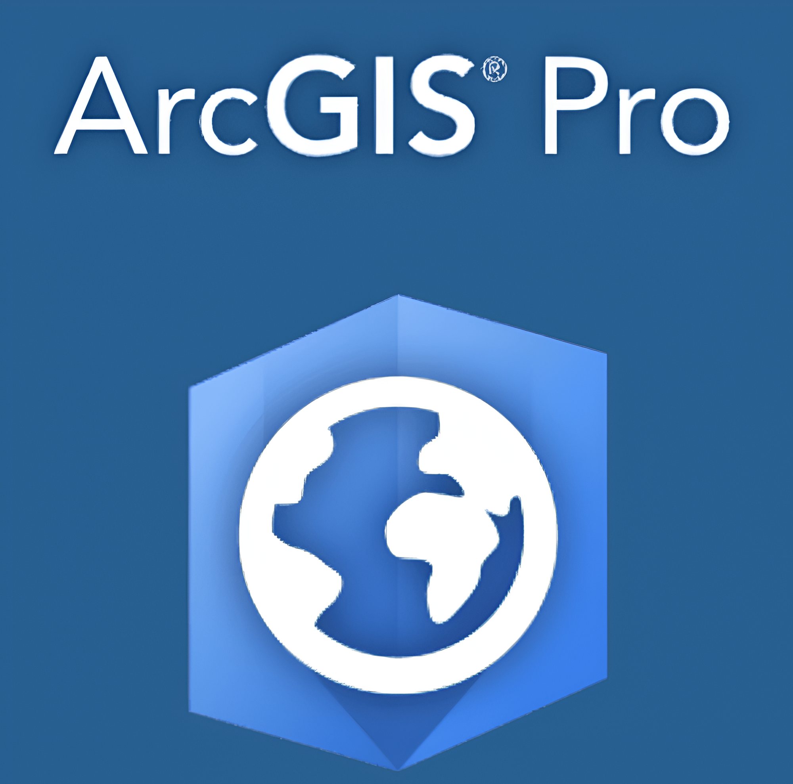

# Research Resources

Explore curated content spanning modern geospatial technologies, conference workshops, and essential learning materials.

## 🎤 Conferences & Workshops
Summaries and technical insights from international research gatherings.

::: {.innovation-section}
::: {.innovation-grid}

::: {.innovation-card}

::: {.innovation-card-label}
[ML for Remote Sensing (ICLR 2023)](ml-remote-sensing.qmd){.stretched-link}
:::
::: {.innovation-card-desc}
Detailed breakdown of the Machine Learning for Remote Sensing workshop at ICLR 2023.
:::
:::

:::
:::

 

## 📖 Research Guides & Notes
Technical transitions and deep-dives into geospatial methodologies.

::: {.innovation-section}
::: {.innovation-grid}

::: {.innovation-card}

::: {.innovation-card-label}
[Cloud GIS & Open Source](cloud-gis.qmd){.stretched-link}
:::
::: {.innovation-card-desc}
Analysis of moving from proprietary cloud platforms to Python and R ecosystems.
:::
:::

:::
:::

 

## 📚 Essential Learning (External)
Curated external resources for mastering GIS, ML, and Remote Sensing.

::: {.innovation-section}
::: {.innovation-grid}

::: {.innovation-card}

::: {.innovation-card-label}
[Cloud-Based RS with GEE](https://www.eefabook.org/){.stretched-link}
:::
::: {.innovation-card-desc}
The fundamental book for learning Google Earth Engine (EEFA Book).
:::
:::

::: {.innovation-card}

::: {.innovation-card-label}
[1. Intro to GIS in Python](https://autogis-site.readthedocs.io/en/latest/lessons/L1/overview.html){.stretched-link}
:::
::: {.innovation-card-desc}
Geometric objects and GeoPandas fundamentals.
:::
:::

::: {.innovation-card}

::: {.innovation-card-label}
[2. CRS and Spatial Joins](https://autogis-site.readthedocs.io/en/latest/lessons/L2/overview.html){.stretched-link}
:::
::: {.innovation-card-desc}
Managing projections and spatial data integration.
:::
:::

::: {.innovation-card}

::: {.innovation-card-label}
[3. Geocoding & Queries](https://autogis-site.readthedocs.io/en/latest/lessons/L3/overview.html){.stretched-link}
:::
::: {.innovation-card-desc}
Spatial queries and address-to-coordinate conversion.
:::
:::

::: {.innovation-card}

::: {.innovation-card-label}
[4. Reclassification](https://autogis-site.readthedocs.io/en/latest/lessons/L4/overview.html){.stretched-link}
:::
::: {.innovation-card-desc}
Attribute reclassification and overlay analysis.
:::
:::

::: {.innovation-card}

::: {.innovation-card-label}
[5. Network Analysis](https://autogis-site.readthedocs.io/en/latest/lessons/L5/overview.html){.stretched-link}
:::
::: {.innovation-card-desc}
Shortest path algorithms and service areas.
:::
:::

::: {.innovation-card}

::: {.innovation-card-label}
[6. Data Visualization](https://autogis-site.readthedocs.io/en/latest/lessons/L6/overview.html){.stretched-link}
:::
::: {.innovation-card-desc}
Professional mapping and interactive web maps.
:::
:::

::: {.innovation-card}

::: {.innovation-card-label}
[Practical Deep Learning](https://course.fast.ai/){.stretched-link}
:::
::: {.innovation-card-desc}
Deep Learning applications for real-world problems.
:::
:::

:::
:::

 

## 💡 Additional Material

For further technical documentation, visit the [Courses](../courses.qmd) section or explore the [Blog](../blog.qmd) for the latest research updates.
