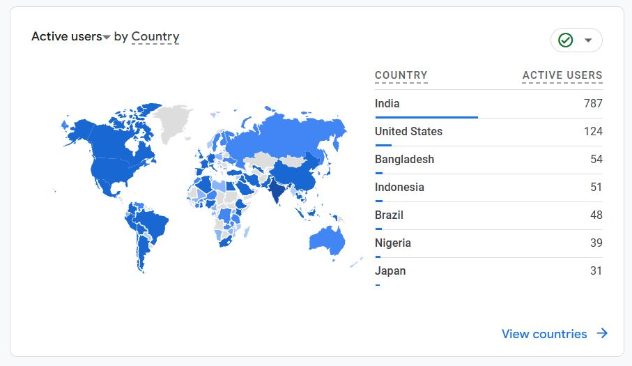

::: {.column-page}

## 📱 Social Feed

::: {.social-card style="display: grid; grid-template-columns: 2fr 1fr; gap: 20px; border: 1px solid rgba(0,0,0,0.05); padding: 25px; border-radius: 16px; margin-bottom: 30px; background: #f0f7ff; box-shadow: 0 4px 15px rgba(0,0,0,0.02);"}
::: {.social-content}
### XXII INQUA Congress 2027 India
**“Quaternary Science As Societal Services”**
Lucknow, India | **January 28 - February 3, 2027**

The biggest conference in Quaternary Sciences, featuring **188 Scientific Sessions**, **21 Workshops**, and **46 Field Trips**. Funding available for participants.

**📢 Important Update:**
*   **Abstract Submission EXTENDED:** 31st March, 2026

[Register Now](https://register.inquaindia2027.in/){style="background: rgba(255,255,255,0.7); border: 1px solid rgba(0,0,0,0.1); padding: 8px 16px; border-radius: 50px; text-decoration: none; color: #1a5f7a; font-weight: 600; font-size: 0.9rem;"}
[First Circular (PDF)](https://framerusercontent.com/assets/uuOMCk51ous9qnKWe3ZLZbrTglI.pdf){style="background: rgba(255,255,255,0.7); border: 1px solid rgba(0,0,0,0.1); padding: 8px 16px; border-radius: 50px; text-decoration: none; color: #1a5f7a; font-weight: 600; font-size: 0.9rem;"}

:::
::: {.social-media style="display: flex; align-items: center;"}
[{style="border-radius: 12px; width: 100%; box-shadow: 0 5px 15px rgba(0,0,0,0.08);"}](https://www.inquaindia2027.in/)
:::
:::

::: {.social-card style="display: grid; grid-template-columns: 2fr 1fr; gap: 20px; border: 1px solid rgba(0,0,0,0.05); padding: 25px; border-radius: 16px; margin-bottom: 30px; background: #fff9f0; box-shadow: 0 4px 15px rgba(0,0,0,0.02);"}
::: {.social-content}
### Western Regional Conference: IASP 2026
**“Demographic Transition in Western India”**
Organized jointly with **Goa Business School, Goa University**

**Dates:** March 20-21, 2026

| Event | Date |
|-------|------|
| Abstract Submission | 15th Feb, 2026 |
| Registration | 18th - 25th Feb |
| Full paper | 10th March, 2026 |

[Submit Abstract](https://forms.gle/dxgmZAGrdk5HdWVw5){style="background: rgba(255,255,255,0.7); border: 1px solid rgba(0,0,0,0.1); padding: 8px 16px; border-radius: 50px; text-decoration: none; color: #d35400; font-weight: 600; font-size: 0.9rem;"}

:::
::: {.social-media style="display: flex; align-items: center;"}
[{style="border-radius: 12px; width: 100%; box-shadow: 0 5px 15px rgba(0,0,0,0.08);"}](social/population_iasp_2026.pdf)
:::
:::

::: {.social-card style="display: grid; grid-template-columns: 2fr 1fr; gap: 20px; border: 1px solid rgba(0,0,0,0.05); padding: 25px; border-radius: 16px; margin-bottom: 30px; background: #f0fff4; box-shadow: 0 4px 15px rgba(0,0,0,0.02);"}
::: {.social-content}
### AI in Geospatial: Gemini vs ChatGPT
Comparing the roles of Gemini and ChatGPT in modern geospatial workflows and Google Earth Engine.

*Posted on LinkedIn*

[View Original Post](https://www.linkedin.com/posts/pulakeshpradhan_gemini-chatgpt-activity-7384877330587947010-vZv5){style="background: rgba(255,255,255,0.7); border: 1px solid rgba(0,0,0,0.1); padding: 8px 16px; border-radius: 50px; text-decoration: none; color: #219150; font-weight: 600; font-size: 0.9rem;"}

:::
::: {.social-media style="display: flex; align-items: center;"}
[{style="border-radius: 12px; width: 100%; box-shadow: 0 5px 15px rgba(0,0,0,0.08);"}](https://www.linkedin.com/posts/pulakeshpradhan_gemini-chatgpt-activity-7384877330587947010-vZv5)
:::
:::

:::
