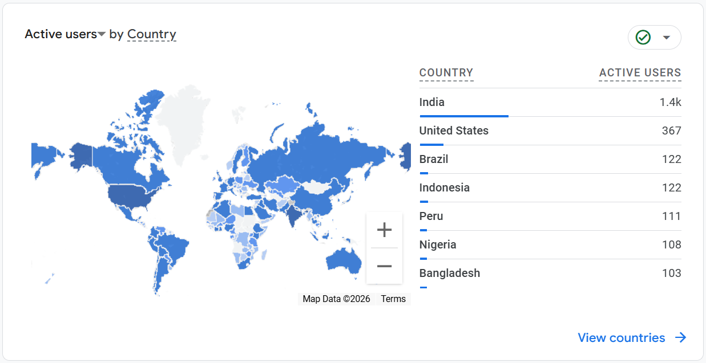
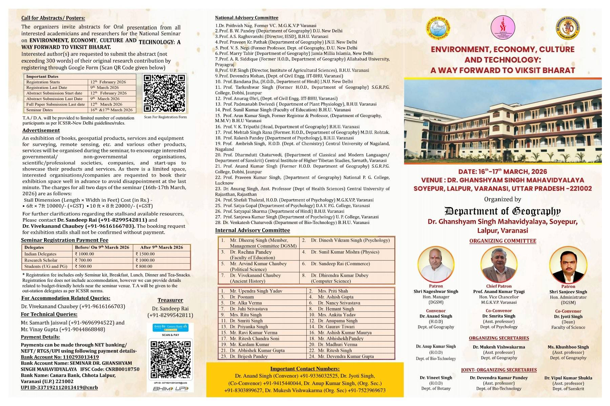

::: {.column-page}

## 📱 Social Feed

::: {.social-card style="display: grid; grid-template-columns: 2fr 1fr; gap: 20px; border: 1px solid rgba(0,0,0,0.05); padding: 25px; border-radius: 16px; margin-bottom: 40px; background: #f0fdf4; box-shadow: 0 4px 15px rgba(0,0,0,0.02);"}
::: {.social-content}
### GEE AI Assistant: 4k+ Global Users!
**Google Earth Engine Coding Companion**

Empowering the geospatial community with AI! I am proud to share that the **GEE AI Assistant** has reached over **4,000+ worldwide users** across **134 countries**. 

My Gemini-powered assistant helps researchers and developers write Earth Engine code faster and more efficiently. Thank you to my global users for being part of this innovation journey!

[Install Extension](https://chromewebstore.google.com/detail/kldhacnbicjpbdiebjjflnhgcmheokkl?utm_source=item-share-cb){style="background: #15803d; border: 1px solid rgba(0,0,0,0.1); padding: 8px 16px; border-radius: 50px; text-decoration: none; color: white; font-weight: 600; font-size: 0.9rem;"}
[View Details](innovations.qmd){style="background: rgba(255,255,255,0.7); border: 1px solid rgba(0,0,0,0.1); padding: 8px 16px; border-radius: 50px; text-decoration: none; color: #166534; font-weight: 600; font-size: 0.9rem;"}

:::
::: {.social-media style="display: flex; align-items: center;"}
[{style="border-radius: 12px; width: 100%; box-shadow: 0 5px 15px rgba(0,0,0,0.08);"}](https://chromewebstore.google.com/detail/kldhacnbicjpbdiebjjflnhgcmheokkl?utm_source=item-share-cb)
:::
:::

### 📅 Upcoming Events Summary

| Event Name | Location | Dates | Deadline | Action |
| :--- | :--- | :--- | :--- | :--- |
| **XXth DGSI Int. Conference** | Tirupati, AP | Feb 23–25, 2026 | Feb 10, 2026 | [Circular](social/30-12-2026 First Circular - 2026.pdf) |
| **National Seminar (Viksit Bharat)** | Varanasi, UP | March 16–17, 2026 | March 9, 2026 | [Register](https://docs.google.com/forms/d/e/1FAIpQLSdbFHgO6_CJt_1_UqFPYT2zk116Q2E_MnRm8yFwapiRkx5EZA/viewform) |
| **IASP 2026 Regional Conference** | Goa University | March 20–21, 2026 | Feb 15, 2026 | [Submit](https://forms.gle/dxgmZAGrdk5HdWVw5) |
| **XXII INQUA Congress 2027** | Lucknow, India | Jan 28 – Feb 3, 2027 | March 31, 2026 | [Register](https://register.inquaindia2027.in/) |

 

::: {.social-card style="display: grid; grid-template-columns: 2fr 1fr; gap: 20px; border: 1px solid rgba(0,0,0,0.05); padding: 25px; border-radius: 16px; margin-bottom: 40px; background: #f0f9ff; box-shadow: 0 4px 15px rgba(0,0,0,0.02);"}
::: {.social-content}
### XXth DGSI International Geography Conference
**“Geospatial Technologies in Water and Soil Resource Management for Sustainable Development and Vikasit Bharat”**
**📍 Location:** Sri Venkateswara University, Tirupati
**📅 Date:** February 23–25, 2026

Organized by The Deccan Geographical Society of India (DGSI). This landmark conference explores the intersection of spatial science, resource management, and national development.

[Download Circular (PDF)](social/30-12-2026 First Circular - 2026.pdf){style="background: rgba(255,255,255,0.7); border: 1px solid rgba(0,0,0,0.1); padding: 8px 16px; border-radius: 50px; text-decoration: none; color: #0369a1; font-weight: 600; font-size: 0.9rem;"}

:::
::: {.social-media style="display: flex; align-items: center;"}
[{style="border-radius: 12px; width: 100%; box-shadow: 0 5px 15px rgba(0,0,0,0.08);"}](social/30-12-2026 First Circular - 2026.pdf)
:::
:::

::: {.social-card style="display: grid; grid-template-columns: 2fr 1fr; gap: 20px; border: 1px solid rgba(0,0,0,0.05); padding: 25px; border-radius: 16px; margin-bottom: 40px; background: #f0f7ff; box-shadow: 0 4px 15px rgba(0,0,0,0.02);"}
::: {.social-content}
### XXII INQUA Congress 2027 India
**“Quaternary Science As Societal Services”**
**📍 Location:** Lucknow, India
**📅 Date:** January 28 - February 3, 2027

The biggest conference in Quaternary Sciences, featuring **188 Scientific Sessions**, **21 Workshops**, and **46 Field Trips**. Funding available for participants.

**📢 Important Update:**
*   **Abstract Submission EXTENDED:** 31st March, 2026

[Register Now](https://register.inquaindia2027.in/){style="background: rgba(255,255,255,0.7); border: 1px solid rgba(0,0,0,0.1); padding: 8px 16px; border-radius: 50px; text-decoration: none; color: #1a5f7a; font-weight: 600; font-size: 0.9rem;"}
[First Circular (PDF)](https://framerusercontent.com/assets/uuOMCk51ous9qnKWe3ZLZbrTglI.pdf){style="background: rgba(255,255,255,0.7); border: 1px solid rgba(0,0,0,0.1); padding: 8px 16px; border-radius: 50px; text-decoration: none; color: #1a5f7a; font-weight: 600; font-size: 0.9rem;"}

:::
::: {.social-media style="display: flex; align-items: center;"}
[{style="border-radius: 12px; width: 100%; box-shadow: 0 5px 15px rgba(0,0,0,0.08);"}](https://www.inquaindia2027.in/)
:::
:::

::: {.social-card style="display: grid; grid-template-columns: 2fr 1fr; gap: 20px; border: 1px solid rgba(0,0,0,0.05); padding: 25px; border-radius: 16px; margin-bottom: 40px; background: #fff9f0; box-shadow: 0 4px 15px rgba(0,0,0,0.02);"}
::: {.social-content}
### Western Regional Conference: IASP 2026
**“Demographic Transition in Western India”**
**📍 Location:** Goa Business School, Goa University
**📅 Date:** March 20-21, 2026

A premier conference focusing on the demographic shifts and socio-economic transitions in Western India.

**📅 Last Date for Online Abstract Submission:** 15th February, 2026

[Submit Abstract](https://forms.gle/dxgmZAGrdk5HdWVw5){style="background: rgba(255,255,255,0.7); border: 1px solid rgba(0,0,0,0.1); padding: 8px 16px; border-radius: 50px; text-decoration: none; color: #d35400; font-weight: 600; font-size: 0.9rem;"}
[Download PDF](social/population_iasp_2026.pdf){style="background: rgba(255,255,255,0.7); border: 1px solid rgba(0,0,0,0.1); padding: 8px 16px; border-radius: 50px; text-decoration: none; color: #d35400; font-weight: 600; font-size: 0.9rem;"}

:::
::: {.social-media style="display: flex; align-items: center;"}
[{style="border-radius: 12px; width: 100%; box-shadow: 0 5px 15px rgba(0,0,0,0.08);"}](social/population_iasp_2026.pdf)
:::
:::

::: {.social-card style="display: grid; grid-template-columns: 2fr 1fr; gap: 20px; border: 1px solid rgba(0,0,0,0.05); padding: 25px; border-radius: 16px; margin-bottom: 40px; background: #fffcf0; box-shadow: 0 4px 15px rgba(0,0,0,0.02);"}
::: {.social-content}
### National Seminar: Environment, Economy, Culture and Technology
**“A Way Forward to Viksit Bharat”**
**📍 Location:** Dr. Ghanshyam Singh Mahavidyalaya, Varanasi
**📅 Date:** March 16-17, 2026

Organized by the Department of Geography. This seminar invites abstracts for oral presentations on the intersection of environment, economy, and technology.

**📅 Key Dates:**
*   **Abstract Submission Deadline:** 9th March, 2026
*   **Full Paper Submission:** 12th March, 2026

[Register Now](https://docs.google.com/forms/d/e/1FAIpQLSdbFHgO6_CJt_1_UqFPYT2zk116Q2E_MnRm8yFwapiRkx5EZA/viewform){style="background: rgba(255,255,255,0.7); border: 1px solid rgba(0,0,0,0.1); padding: 8px 16px; border-radius: 50px; text-decoration: none; color: #854d0e; font-weight: 600; font-size: 0.9rem;"}
[Contact Details](#){style="background: rgba(255,255,255,0.7); border: 1px solid rgba(0,0,0,0.1); padding: 8px 16px; border-radius: 50px; text-decoration: none; color: #854d0e; font-weight: 600; font-size: 0.9rem;"}

:::
::: {.social-media style="display: flex; align-items: center;"}
[{style="border-radius: 12px; width: 100%; box-shadow: 0 5px 15px rgba(0,0,0,0.08);"}](social/viksit_bharat_seminar.jpg)
:::
:::

:::
